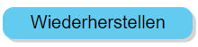

# Sudoku-Solver

Du hast jahrelange Erfahrung mit der Lösung von Sudokus. Und Du bist mit der Zeit spürbar besser geworden. Und dann kommt ein Sudoku, manchmal auch nur als mittelschwer klassifiziert, und Du findest keine Lösung. Dann benutze diesen Sudoku-Solver. Er löst jedes Sudoku in wenigen Minuten und Du kannst ihm dabei zuschauen.

## Überblick

## Typischer Ablauf

1. Sudoku eingeben: "Definieren" wählen.
2. Sudoku lösen: "Spielen" wählen.

In beiden Fällen besteht ein Spielschritt aus zwei Schritten:

1. Sudoku-Zelle selektieren.
2. Nummer setzen: D.h. eine Nummer in der "Manuellen Ausführung" wählen.

Solltest Du eine Nummern-Setzung zurücknehmen wollen, so selektiere die betroffene Zelle und betätige die rote Lösch-Taste.

## Die möglichen Inhalte einer Sudoku-Zelle

|Zelle  |Bedeutung  |
|---------|---------|
||In dieser Zelle wurde während der Definitionsphase die Nummer 3 gesetzt. Erkennbar an der schwarzen Schriftfarbe.|
||In dieser Zelle wurde in der Spielphase die Nummer 7 gesetzt. Erkennbar an der blauen Schriftfarbe.|
||Für diese Zelle wurde noch keine Nummer gesetzt. Du kannst nur noch eine der Nummern 1, 3, 7 und 8 wählen. Wählst Du dennoch eine andere Nummer, kommt es zu einem Konflikt. Zwei gleiche Nummern in einer Spalte, Reihe oder Zellgruppe. Die betroffenen Zellen werden rot markiert.|
||Für diese Zelle wurde noch keine Nummer gesetzt. Ohne direkten Konflikt sind noch die drei Nummern 2, 7 und 9 setzbar. Jedoch hat der Solver ermittelt, dass die Nummer 2 notwendig ist, damit das Sudoku lösbar bleibt.|
||Für diese Zelle wurde noch keine Nummer gesetzt. Allerdings gibt es keine zulässige Nummer mehr, die noch gesetzt werden könnte. Wenn das Sudoku noch erfolgreich gelöst werden soll, müssen ein oder mehrere der bisherigen Nummernsetzungen zurückgenommen werden.|
||Für diese Zelle wurde noch keine Nummer gesetzt. Ohne direkten Konflikt sind noch die drei Nummern 7, 8 und 9 setzbar. Jedoch hat der Solver zwei notwendige Nummern für diese Zelle ermittelt. Das geht natürlich nicht. Wenn das Sudoku noch erfolgreich gelöst werden soll, müssen ein oder mehrere der bisherigen Nummernsetzungen zurückgenommen werden.|
||Für diese Zelle wurde die Nummer 8 gesetzt. Das führte zu einem Konflikt. Zwei gleiche Nummern in einer Spalte, Reihe oder Zellgruppe. Das zweite oder dritte Auftreten der Nummer wird ebenfalls rot angezeigt.|

## Zwei Phasen

|Phase  |Bedeutung  |
|---------|---------|
||Das Drücken dieser Taste versetzt den Solver in die Definitionsphase. In dieser Phase überträgt man die zu lösende Sudoku-Aufgabe in den Solver.|
||Das Drücken Drücken dieser Taste versetzt den Solver in die Spielphase. Die Spielphase kann manuell oder automatisch durchgeführt werden.|

## Manuelle Ausführung

Die manuelle Ausführung wird in jedem Fall in der Definitionsphase genutzt. In der Spielphase ist sie optional. Die Spielphase kann alternativ auch automatisch durchgeführt werden.

## Automatische Ausführung

|Taste  |Bedeutung  |
|---------|---------|
||Die Play-Taste. Der Solver startet den automatischen Lösungssuchprozess. Zusätzlich wird ein Timer gestartet, der in der eingestellten Geschwindigkeit die Ausführung automatischer Suchschritte anstößt.|
||Die Pause-Taste. Der Taktgeber der automatischen Ausführung wird angehalten, nicht jedoch der Suchprozess abgebrochen. Der Spieler kann jetzt weitere automatische Suchschritte mit der Step-Taste von Hand anstoßen. Oder er kann durch das erneute Drücken der Play-Taste die getaktete automatische Ausführung fortsetzen.|
||Die Stop-Taste. Der Taktgeber der automatischen Ausführung wird angehalten und der aktuelle Suchprozess wird abgebrochen.|
||Die Step-Taste. Der Solver führt den nächsten automatischen Suchschritt aus. Falls noch nicht geschehen, startet er zuvor den Suchprozess überhaupt.|

## Initialisieren und Zurücksetzen

|Taste  |Bedeutung  |
|---------|---------|
||Der Solver wird initialisiert. Danach ist die Sudoku-Tabelle leer.|
||Der Solver wird zurückgesetzt auf die Aufgabenstellung. D.h. alle in der Spielphase gesetzten Zellen werden gelöscht. Die Zellen der Definitionsphase bleiben erhalten.|

## Spielstände speichern und wiederherstellen

Spielstände können im lokalen Speicher des Browsers gespeichert werden, nicht jedoch auf dem Computer selbst. Internet-Anwendungen ist generell nicht gestattet, auf Inhalte des Computers zuzugreifen. D.h. Man kann seine gespeicherten Zustände nur in dem Browser wiederfinden, in dem sie gespeichert wurden.

|Taste  |Bedeutung  |
|---------|---------|
||Der aktuelle Spielstand kann unter einem Namen gespeichert werden. Oft wird man den Zustand nach der Fertigstellung der Definition speichern wollen.|
||Ein gespeicherter Zustand wird wiederhergestellt. Dabei wird der aktuelle Zustand gelöscht.|
||Ein gespeicherter Zustand wird gelöscht.|

## Den Lösungssuchprozess beobachten

Dieser Sudoku-Solver erlaubt es, ihm beim Suchen zuzusehen. Er zeigt an, wie er im Suchprozess vorwärts und rückwärts geht. Rückwärts muss er gehen, wenn er alle zulässigen Nummern einer Zelle durchprobiert hat und noch keine Lösung gefunden hat. Im Fachjargon: Der Solver realisiert einen Back-Track-Algorithmus.

Er zeigt die aktuelle und die bisher maximal erreichte Suchtiefe an. Immer wenn er auf eine Zelle trifft, in der es noch keine eindeutige Nummernwahl gibt, erhöht er seine Suchtiefe.
