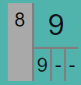
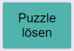

# Sudoku-Solver

Wer kennt das nicht? Beim Kaffee-Trinken ein Sudoku lösen. Nach jahrelanger Erfahrung ist man spürbar besser geworden. Und dann kommt ein Sudoku, manchmal auch nur als mittelschwer klassifiziert, und man findet einfach keine Lösung. Anstatt den Kaffee-Tisch frustriert zu verlassen, benutze diesen Sudoku-Solver. Er löst jedes Sudoku in wenigen Minuten und man kann ihm dabei zuschauen. Schritt für Schritt kann man verstehen, wie der Solver zur Lösung des Sudokus gelangt.

## Überblick

## Typischer Ablauf

1. **Sudoku eingeben:** "Definieren" wählen und die Zellen mit den Nummern der Sudoku-Aufgabe setzen.
2. **Sudoku lösen:** "Spielen" wählen und die Zellen mit den vermutet richtigen Nummern belegen.

In beiden Fällen besteht ein Spielschritt aus zwei Subschritten:

- Sudoku-Zelle selektieren.
- Nummer setzen: D.h. eine Nummer in der "Manuellen Ausführung" wählen.

Solltest Du eine Nummern-Setzung zurücknehmen wollen, so selektiere die betroffene Zelle und betätige die rote Lösch-Taste.

## Die möglichen Inhalte einer Sudoku-Zelle

|Zelle  |Bedeutung  |
|---------|---------|
||**In der Definitionsphase gesetzte Nummer:** In dieser Zelle wurde während der Definitionsphase die Nummer 3 gesetzt.|
||**In der Spielphase gesetzte Nummer:** In dieser Zelle wurde in der Spielphase manuell oder automatisch die Nummer 5 gesetzt. Wenn sie automatisch gesetzt wurde, wurde die automatische Ausführung des Solvers inzwischen gestoppt. Mit dem Stoppen der automatischen Ausführung wird in den Spielzellen die Information über die automatische Ausführung gelöscht.
||**Automatisch gesetzte Nummer:** Der Solver hat in dieser Zelle automatisch die Nummer 2 gesetzt. Und zwar in der 17. Setzung einer Nummer. Die Wahl der zu setzenden Nummer war eindeutig.|
||**Automatisch gesetzte Nummer einer Auswahl:** Der Solver hat in dieser Zelle automatisch die Nummer 9 gesetzt. Und zwar in der 11. Setzung einer Nummer. Er musste zwischen den beiden Nummern 4 und 9 wählen. Der Solver wählt zunächst die Nummer 9. Wenn die Vervollständigung der Matrix gelingt, kommt die zweite Nummer nicht mehr zum Zuge. Gelingt die Vervollständigung nicht, kehrt der Automat zu dieser Zelle zurück und probiert die zweite Option 4. Die Optionen werden von rechts nach links abgearbeitet. Das Bild zeigt die Option 9 als abgearbeitet. Option 4 wurde noch nicht probiert. Noch nicht abgearbeitete Nummern werden in gelber Schrift angezeigt.|
||**Zulässige Nummern:** Für diese Zelle wurde noch keine Nummer gesetzt. Du kannst nur noch eine der Nummern 1, 3, 5 und 7 wählen. Das sind die (noch) zulässigen Nummern der Zelle. Die nicht aufgeführten Nummern sind direkt unzulässig. Eine Nummer ist direkt unzulässig, wenn die Nummer bereits gesetzt ist in der Gruppe, Zeile oder Spalte der Zelle. Wählst Du eine direkt unzulässige Nummer, kommt es zu einem direkten Konflikt. Zwei gleiche Nummern in einer Spalte, Reihe oder Zellgruppe. Die betroffenen Zellen werden rot markiert.|
||**Notwendige Nummer:** Für diese Zelle wurde noch keine Nummer gesetzt. Ohne direkten Konflikt sind noch die fünf Nummern 4, 6, 7 und 8 setzbar. Jedoch hat der Solver ermittelt, dass die Nummer 7 notwendig ist, damit das Sudoku lösbar bleibt. 7 ist eine notwendige Nummer für diese Zelle. Eine Nummer in einer Zelle ist notwendig, wenn die Nummer in ihrer Gruppe, Zeile oder Spalte einzig ist. Im Beispiel ist die Nummer 7 nicht eindeutig in ihrer Spalte, ebenso nicht in ihrer Gruppe aber eindeutig in ihrer Zeile. |
||**Indirekt unzulässige Nummer:** Für diese Zelle wurde noch keine Nummer gesetzt. Ohne direkten Konflikt sind noch die fünf Nummern 1, 7 und 8 setzbar. Jedoch ist die Nummer 7 indirekt unzulässig. **Pairing-Kriterium:** Eine Nummer ist z.B. indirekt unzulässig, wenn es in einer Gruppe, Zeile oder Spalte Paare gibt und Nummern dieser Paare zusätzlich in weiteren Zellen dieser Gruppe, Spalte oder Zeile auftauchen. Im Beispiel sind das Paar die beiden Zellen mit den Nummern 3 und 7. Fest steht, dass diese beiden Zellen die Nummern 3 und 7 aufnehmen. Es ist lediglich noch offen, welche der Zellen die 3 oder 7 haben wird. Daraus folgt, dass in der Zeile keine weitere 3 oder 7 mehr auftauchen kann. Die 7 ist indirekt unzulässig und deshalb rot markiert. **Ausschluss-Kriterium:** Ebenso ist eine Nummer indirekt unzulässig, wenn sie in ihrer Spalte, Reihe oder Gruppe auch als notwendige Nummer auftritt. Im vorigen Beispiel sind alle roten Nummern 7 und 9 wegen notwendigen Nummern ausgeschlossene Nummern.
||**Leere Option:** Für diese Zelle wurde noch keine Nummer gesetzt. Allerdings gibt es keine zulässige Nummer mehr, die noch gesetzt werden könnte. D.h. das Sudoku ist unlösbar. Wenn das Sudoku noch erfolgreich gelöst werden soll, müssen ein oder mehrere der bisherigen Nummernsetzungen zurückgenommen werden. Tritt während der automatischen Ausführung eine solche Zelle auf, schaltet der Solver in den Rückwärts-Modus um.|
||**Widersprüchliche Notwendigkeit:** Für diese Zelle wurde noch keine Nummer gesetzt. Ohne direkten Konflikt sind noch die Nummern 1, 2, 3, 6, 7 und 8 setzbar. Jedoch hat der Solver zwei notwendige Nummern für diese Zelle ermittelt: 1 und 2. Das geht natürlich nicht. Es können in einer Zelle nicht zwei Nummern gleichzeitig gesetzt werden. D.h. das Sudoku ist unlösbar. Wenn das Sudoku noch erfolgreich gelöst werden soll, müssen ein oder mehrere der bisherigen Nummernsetzungen zurückgenommen werden. Tritt während der automatischen Ausführung eine solche Zelle auf, schaltet der Solver in den Rückwärts-Modus um.|
||**Direkt unzulässige Nummer:** Für diese Zelle wurde die Nummer 8 gesetzt. Diese Nummer ist direkt unzulässig, weil in der Spalte, Reihe oder Zellgruppe dieser Zelle bereits eine 8 gesetzt ist. Das zweite oder dritte Auftreten der Nummer wird ebenfalls rot unterlegt angezeigt.|
|| **Widerspruch: Notwendig - Indirekt unzulässig:** Für diese Zelle soll die Nummer 3 gleichzeitig notwendig und indirekt unzulässig sein. D.h. das Sudoku ist unlösbar. Wenn das Sudoku noch erfolgreich gelöst werden soll, müssen ein oder mehrere der bisherigen Nummernsetzungen zurückgenommen werden. Tritt während der automatischen Ausführung eine solche Zelle auf, schaltet der Solver in den Rückwärts-Modus um.|

## Zwei Phasen

|Phase  |Bedeutung  |
|---------|---------|
||Die Taste **Definieren**. Das Drücken dieser Taste versetzt den Solver in die Definitionsphase. In dieser Phase überträgt man die zu lösende Sudoku-Aufgabe in den Solver. Nach der Initialisierung ist diese Taste automatisch gesetzt.|
||Die Taste **Spielen**. Das Drücken dieser Taste versetzt den Solver in die Spielphase. Die Spielphase kann manuell oder automatisch durchgeführt werden. Wird die automatische Ausführung gestartet, wird diese Taste automatisch gesetzt.|

## Manuelle Ausführung

Die manuelle Ausführung wird in jedem Fall in der Definitionsphase genutzt. In der Spielphase ist sie optional. Die Spielphase kann alternativ auch automatisch durchgeführt werden.

## Automatische Ausführung

|Taste  |Bedeutung  |
|---------|---------|
||Die **Play-Taste**. Der Solver startet den automatischen Lösungssuchprozess. Zusätzlich wird ein Timer gestartet, der in der eingestellten Geschwindigkeit die Ausführung automatischer Suchschritte anstößt.|
||Die **Pause-Taste**. Der Taktgeber der automatischen Ausführung wird angehalten, nicht jedoch der Suchprozess abgebrochen. Der Spieler kann jetzt weitere automatische Suchschritte mit der Step-Taste von Hand anstoßen. Oder er kann durch das erneute Drücken der Play-Taste die getaktete automatische Ausführung fortsetzen.|
||Die **Stop-Taste**. Der Taktgeber der automatischen Ausführung wird angehalten und der aktuelle Suchprozess wird abgebrochen.|
||Die **Step-Taste**. Der Solver führt den nächsten automatischen Suchschritt aus. Falls noch nicht geschehen, startet er zuvor den Suchprozess überhaupt. Mit dieser Taste kann man den Solver Schritt für Schritt arbeiten lassen und so jeden einzelnen seiner Schritte verstehen.|

## Initialisieren und Zurücksetzen

|Taste  |Bedeutung  |
|---------|---------|
||Die Taste **Initialisieren**. Durch das Drücken dieser Taste wird der Solver wird initialisiert. Danach ist die Sudoku-Tabelle leer.|
||Die Taste **Zurücksetzen**. Mittels dieser Taste wird der Solver zurückgesetzt auf die Aufgabenstellung. D.h. alle in der Spielphase gesetzten Zellen werden gelöscht. Die Zellen der Definitionsphase bleiben erhalten.|

## Spielstände speichern und wiederherstellen

Spielstände können im lokalen Speicher des Browsers gespeichert werden, nicht jedoch auf dem Computer selbst. Internet-Anwendungen ist es generell nicht gestattet, auf Inhalte des Computers zuzugreifen. D.h. Man kann seine gespeicherten Zustände nur in dem Browser wiederfinden, in dem sie gespeichert wurden.

|Taste  |Bedeutung  |
|---------|---------|
||Die Taste **Speichern unter...**. Mit dieser Taste kann der aktuelle Spielstand unter einem Namen gespeichert werden. Oft wird man den Zustand nach der Fertigstellung der Definition speichern wollen.|
||Die Taste **Wiederherstellen**. Mit Hilfe dieser Taste kann ein zuvor gespeicherter Zustand wiederhergestellt werden. Dabei wird der aktuelle Zustand gelöscht.|
||Die Taste **Löschen**. Mit dieser Taste kann ein gespeicherter Zustand  gelöscht werden.|

## Den Solver bei der Lösungssuche beobachten

Dieser Sudoku-Solver erlaubt es, ihm beim Suchen zuzusehen. Im Vorwärts-Modus führt er abwechselnd eine Zellselektion und eine Nummernsetzung durch, im Rückwärts-Modus, eine Zellselektion und eine Nummernlöschung.

### Wie wählt der Solver die nächste Zelle und die in ihr zu setzende Nummer?

Der Solver sucht gemäß der folgenden Priorität die nächste offene Zelle:

1. **Zellen mit einer notwendigen Nummer:** Der Solver wählt in der Matrix zunächst die offenen Zellen, die in der Menge ihrer zulässigen Nummern eine notwendige Nummer haben. Diese notwendige Nummer wird dann in der Zelle gesetzt. Wenn es mehrere Zellen mit dieser Eigenschaft, wählt er die erste in seiner Liste.
1. **Zellen mit nur einer zulässigen Nummer**: Dann wählt er Zellen mit nur einer zulässigen Nummer. Denn auch für diese ist die Nummernsetzung eindeutig. Er setzt diese Nummer.
1. **Zellen mit minimaler Anzahl von zulässigen Nummern**. Sind keine eindeutigen Nummernsetzungen mehr verfügbar, wählt er Zellen mit minimaler Anzahl von zulässigen Nummern. In dieser Menge wählt er zufällig die Nummer, die er dann setzt. Im Laufe der weiteren Suche kann sich herausstellen, dass diese Nummer keine Lösung des Sudokus erlaubt. Der Back-Tracking-Prozess kehrt im weiteren Verlauf zu dieser Zelle zurück und versucht dann mit der Wahl einer anderen Nummer die Lösung zu finden.

### Wie prüft der Solver die neu gesetzte Nummer?

Der Solver prüft nach der Setzung einer neuen Nummer, ob das Sudoku mit dieser gesetzten Nummer unlösbar geworden ist. Falls ja, wird der Solver in den Rückwärts-Modus geschaltet und geht zurück bis zu einer Zelle, die mehrere Optionen für eine Nummernsetzung hatte.

## Unlösbare Sudokus

Der automatische Solver setzt solange weitere Nummern in der Matrix, bis er entweder alle Zellen gesetzt hat (das Sudoku ist gelöst), oder er erkennt, dass das Sudoku bei der aktuellen Befüllung unlösbar ist. Ein Sudoku ist unlösbar, wenn es

1. eine unlösbare Zelle besitzt, oder
1. eine unlösbare Gruppe besitzt, oder
1. eine unlösbare Zeile besitzt, oder
1. eine unlösbare Spalte besitzt.

Es können mehrere dieser Bedingungen gleichzeitig vorliegen.

### Unlösbare Zellen

   

Unlösbare Zellen hatten wir oben schon kennengelernt. Es sind dies Zellen mit leerer Option, Zellen mit widersprüchlicher Notwendigkeit, Zellen mit direkt unzulässiger Nummer und Zellen mit Notwendig-Unzulässig-Widerspruch.

### Unlösbare Gruppen

So wie es unlösbare Zellen geben kann - erkennbar an ihrem roten Hintergrund - so kann es auch unlösbare Gruppen geben. Eine Gruppe ist unlösbar,

1. wenn nicht mehr alle Nummern 1 ... 9 in ihr vorkommen. Im ersten Beispiel fehlt die Nummer 3. Oder,
1. wenn eine Nummer gleichzeitig in verschiedene Zellen der Gruppe gesetzt werden soll, wie die 3 im nachfolgenden Beispiel.

Tritt während der automatischen Ausführung eine solche unlösbare Gruppe auf, schaltet der Solver in den Rückwärts-Modus um.

### Unlösbare Zeilen und/oder Spalten

Es kann auch unlösbare Zeilen oder Spalten geben. Eine Spalte oder Zeile ist unlösbar (ganz analog zu der Definition für Gruppen),

1. wenn nicht mehr alle Nummern 1 ... 9 in ihr vorkommen. Oder,
1. wenn eine Nummer gleichzeitig in verschiedene Zellen der Zeile/Spalte gesetzt werden soll, wie die 1 im nachfolgenden Beispiel.

### Vorwärts und Rückwärts

Der Solver zeigt an, wie er im Suchprozess vorwärts und rückwärts geht. Im Fachjargon: Der Solver realisiert einen Back-Tracking-Algorithmus. Rückwärts muss er gehen, wenn die aktuell gesetzte Nummer zur Unlösbarkeit des Sudokus führt. Rückwärtsgehen bedeutet, dass der Solver der Reihe nach zuvor gesetzte Nummern wieder zurücknimmt, bis er auf eine Zelle trifft, in der er mehrere zulässigen Nummern zur Auswahl hatte. Er wählt dann die nächste noch nicht probierte Zahl der Auswahl und geht wieder in den Vorwärts-Modus. Sind alle zulässigen Nummern durchprobiert, geht er weiter rückwärts. Wenn er im Rückwärtsgehen bei der ersten gesetzten Zelle ankommt, hat das Sudoku keine Lösung.

Der Solver zeigt die Anzahl der zurückgelegten Schritte an. Jedes Setzen einer Zelle sowie die Rücknahme einer Setzung erhöht den Zähler um 1. Ebenso zeigt der Solver die Anzahl der Rückwärtsläufe und die bisher maximal erreichte Suchtiefe an. Immer wenn er auf eine Zelle trifft, in der es keine eindeutige Nummernwahl gibt, erhöht er seine Suchtiefe. Die vier Parameter

1. Anzahl der Schritte
1. Anzahl der Rückwärtsläufe
1. die maximale Suchtiefe und
1. die Anzahl der in der Definition schon gesetzten Zellen

bilden ein gutes Kriterium für den Schwierigkeitsgrad der Sudoku-Aufgabe. Die in den Zeitungen oder Zeitschriften als leicht oder mittelschwer klassifizierten Sudoku-Aufgaben kommen in der Regel ganz ohne Rückwärtsläufe aus. Meist haben sie um die 30 bereits gesetzte Definitionszellen. Schwere Sudoku-Aufgaben beginnen mit 22 - 25 Definitionszellen. Bei noch geringerer Anzahl von Definitionszellen dürfte die Sicherstellung der eindeutigen Lösung nicht mehr erreichbar sein.

## Erfolgreiche bzw. nicht erfolgreiche Suche

Der Suchprozess endet erfolgreich oder nicht erfolgreich. Er endet erfolgreich, sobald in allen Zellen eine Nummer gesetzt wurde. Wenn die Sudoku-Aufgabe keine Lösung besitzt, meldet der Solver: "*Keine Lösung gefunden*". Die in Zeitungen und Magazinen gestellten Sudoku-Aufgaben sind in der Regel konsistent und eindeutig. D.h. sie besitzen überhaupt eine Lösung und diese Lösung ist eindeutig. Der Solver findet diese Lösung auf jeden Fall, und dies fast immer mit weniger als 500 Schritten.

Der Solver beherrscht auch Sudokus, die mehrere Lösungen haben. Nach der Erfolgsmeldung mit der ersten Lösung kann der Anwender nach der nächsten Lösung suchen lassen, solange bis der Solver meldet: "*Keine weitere Lösung gefunden*".
