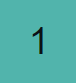
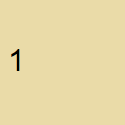
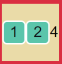
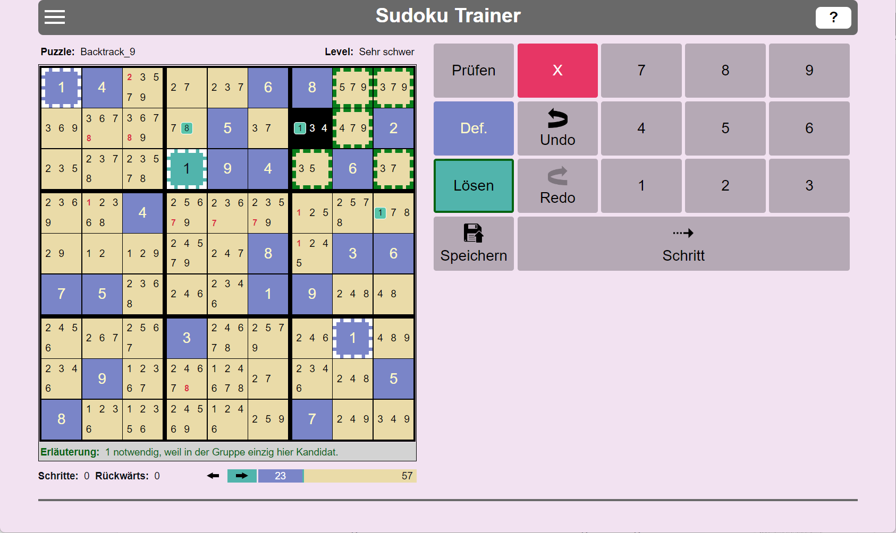
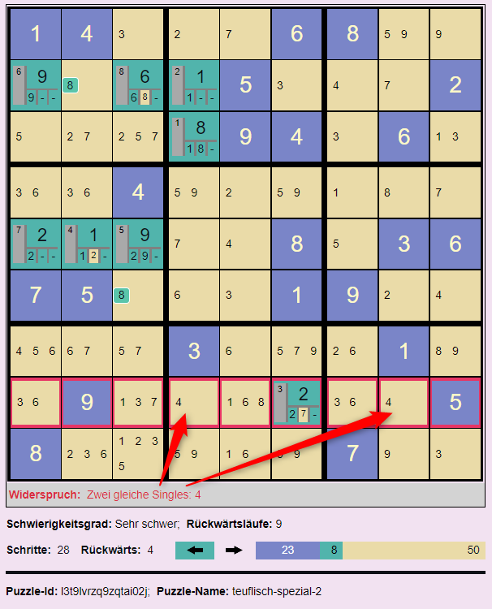

# HB-Sudoku-App

Wer kennt das nicht? Beim Kaffeetrinken ein Sudoku lösen. Nach jahrelanger Erfahrung ist man spürbar besser geworden. Und dann kommt ein Puzzle, manchmal sogar nur als leicht klassifiziert, und man findet partout nicht die nächste Zelle mit einer eindeutigen Nummernbelegung. Anstatt den Kaffeetisch frustriert zu verlassen, kann man die HB-Sudoku-App und den darin enthaltenen Solver nutzen. Er löst jedes Sudoku in wenigen Minuten.

Das tun andere Sudoku-Solver auch. Die Besonderheit des HB-Sudoku-Solvers besteht darin, dass man ihm bei der Lösungssuche zuschauen kann. Schritt für Schritt kann man beobachten und verstehen, wie der Solver zur Lösung des Sudokus gelangt. Alternativ kann man sich auch einfach nur einen nächsten möglichen Schritt zeigen lassen und dann von Hand weitermachen.

Zusammen mit der Lösung bestimmt der Solver den tatsächlichen Schwierigkeitsgrad des Sudokus. Sehr schwere Sudokus, Definition siehe unten, sind manuell kaum zu lösen. Sie sollten daher kein Grund für Frust sein. Konsequenz: Mit der HB-Sudoku-App macht das Sudokulösen Spaß, auch wenn mal ein schweres Puzzle dabei ist.

## App-Überblick

Die HB-Sudoku-App besteht aus zwei Komponenten, dem Sudoku-Solver/Generator und der Puzzle-Datenbank. Mit Hilfe des Sudoku-Solvers kann man beliebige Sudoku-Puzzles, manuell oder automatisch lösen. Mittels des Sudoku-Generators kann man neue Puzzles generieren. In der Puzzle-Datenbank können Puzzles mit ihren Eigenschaften, etwa dem Schwierigkeitsgrad, den benötigten Lösungsschritten und der Lösung selbst gespeichert werden.

## Der Sudoku-Solver

Der Solver besteht im Wesentlichen aus der 9 x 9 Sudoku-Matrix. In den Zellen der Matrix können Nummern von 1 .. 9 gesetzt werden. Um den Lösungser zu unterstützen, werden für Zellen, die noch keine gesetzte Nummer haben, die aktuell noch möglichen Nummern, die zulässigen Nummern, der Zelle angezeigt. Zusätzlich werden die Zellen der Matrix in 3 x 3 Gruppen unterteilt, 9 an der Zahl.

### Typischer Ablauf der Lösung eines Sudoku-Puzzles

1. **Sudoku-Puzzle eingeben:** "Definieren" wählen und die Zellen mit den Nummern der Sudoku-Aufgabe setzen.
2. **Sudoku-Puzzle lösen:** "Lösen" wählen und die Zellen mit den vermutet richtigen Nummern belegen.

Beim Definieren wie auch beim Lösen besteht ein Lösungsschritt aus zwei Subschritten:

1. **Sudoku-Zelle selektieren**.
1. **Nummer setzen**: D.h. eine Nummer in "Manuell Lösen" wählen. Es kann auch einfach nur eine Nummerntaste für die Eingabe einer Nummer benutzt werden.

Soll eine Nummern-Setzung zurückgenommen werden, muss die betroffene Zelle selektiert werden und dann die rote Lösch-Taste gedrückt werden.

### Die möglichen Inhalte einer Sudoku-Zelle

|Zelle  |Bedeutung  |
|---------|---------|
||**In der Definitionsphase gesetzte Nummer:** In dieser Zelle wurde während der Definitionsphase die Nummer 3 gesetzt.|
||**In der Lösungsphase gesetzte Nummer:** In dieser Zelle wurde in der Lösungsphase manuell oder automatisch die Nummer 5 gesetzt. Wenn sie automatisch gesetzt wurde, wurde die automatische Ausführung des Solvers inzwischen gestoppt. Mit dem Stoppen der automatischen Ausführung wird in den Lösungszellen die Information über die automatische Ausführung gelöscht.
||**Automatisch gesetzte Nummer (Nummer eindeutig):** Der Solver hat in dieser Zelle automatisch die Nummer 9 gesetzt. Und zwar in der 5. Setzung einer Nummer. Die Wahl der zu setzenden Nummer war eindeutig. D.h. Die Nummer war eine notwendige Nummer oder ein Single. Definitionen siehe weiter unten.|
||**Automatisch gesetzte Nummer einer Auswahl (Erste Nummer von zwei Optionen):** Der Solver hat in dieser Zelle automatisch die Nummer 3 gesetzt. Und zwar in der 18. Setzung einer Nummer. Er musste zwischen den beiden Nummern 3 und 7 wählen. Der Solver wählt zunächst die Nummer 3. Wenn die Vervollständigung der Matrix gelingt, kommt die zweite Nummer nicht mehr zum Zuge. Gelingt die Vervollständigung nicht, kehrt der Automat zu dieser Zelle zurück und probiert die zweite Option 7. Die Option 7 wurde noch nicht probiert. Noch nicht abgearbeitete Nummern werden mit gelbem Hintergrund angezeigt.|
||**Automatisch gesetzte Nummer einer Auswahl (Erste Nummer von mehr als zwei Optionen):** Der Solver hat in dieser Zelle automatisch die Nummer 2 gesetzt. Und zwar in der 11. Setzung einer Nummer. Er musste zwischen den Nummern 2, 3 und noch weiteren hier nicht sichtbaren durch den Stern repräsentierten Nummern wählen. Der Solver wählt zunächst die Nummer 2. Wenn die Vervollständigung der Matrix gelingt, kommt die zweite Nummer nicht mehr zum Zuge. Gelingt die Vervollständigung nicht, kehrt der Automat zu dieser Zelle zurück und probiert die zweite Option 3. Nach und nach werden die nicht sichtbaren Optionen angezeigt. In der Praxis kommt der Versuch einer dritten Option so gut wie überhaupt nicht vor, weil zuvor schon eine Lösung gefunden wurde.|
||**Automatisch gesetzte Nummer einer Auswahl (Zweite Nummer von zwei Optionen):** Der Solver hat in dieser Zelle automatisch die Nummer 6 gesetzt. Und zwar in der 1. Setzung einer Nummer. Nach der ersten Option 3 hat er die zweite Option 6 gewählt. Jetzt sind alle Optionen dieser Zelle abgearbeitet.|
||**Zulässige Nummern:** Für diese Zelle wurde noch keine Nummer gesetzt. Nur noch eine der Nummern 1, 2, 6 und 9 kann gewählt werden. Das sind die (noch) zulässigen Nummern der Zelle. Die nicht aufgeführten Nummern sind direkt unzulässig.|
||**Notwendige Nummer:** Für die nebenstehende Zelle wurde noch keine Nummer gesetzt. Ohne direkten Konflikt sind noch die drei Nummern 1, 2 und 6 setzbar. Jedoch hat der Solver ermittelt, dass die Nummer 2 notwendig ist, damit das Sudoku lösbar bleibt. 2 ist eine notwendige Nummer für diese Zelle. Eine Nummer in einer Zelle ist notwendig, wenn die Nummer in ihrer Gruppe, Zeile oder Spalte einzig ist. D.h. sie kommt in der betreffenden Gruppe, Zeile oder Spalte nur genau einmal vor.|
||**Indirekt unzulässige Nummer:** Für die nebenstehende Zelle wurde noch keine Nummer gesetzt. Zulässige Nummern dieser Zelle sind die drei Nummern 3, 6 und 7.Jedoch hat der Solver ermittelt, dass die 7 indirekt unzulässig ist. Wenn man sie setzen würde, würde der Solver einige Schritte später die Widersprüchlichkeit des Puzzles feststellen. Zur Definition der indirekten Unzulässigkeit siehe den entsprechenden Abschnitt dieser Hilfe.|
| | **Singles:** Eine Single-Nummer ist eine zulässige Nummer in einer Zelle, wenn es keine weiteren zulässigen Nummern in der Zelle gibt. Im nebenstehenden Beispiel sind die 5 und die 6 Singles. Die 5 bezeichnen wir auch als **direktes Single**, weil zu seiner Bestimmung nicht auf indirekt unzulässige Nummern zurückgegriffen werden muss. Im Gegensatz dazu ist die 6 ein **indirektes Single**. Die 6 ist in dieser Zelle ein Single, weil die rote 1 und 3 indirekt unzulässig sind.|
||**Widerspruch - Leere Option:** Für diese Zelle wurde noch keine Nummer gesetzt. Allerdings gibt es keine zulässige Nummer mehr, die noch gesetzt werden könnte. D.h. das Sudoku ist widersprüchlich. Wenn das Sudoku noch erfolgreich gelöst werden soll, müssen ein oder mehrere der bisherigen Nummernsetzungen zurückgenommen werden. Tritt während der automatischen Ausführung eine solche Zelle auf, schaltet der Solver in den Rückwärts-Modus um.|
||**Widerspruch - zwei notwendige Nummern:** Für diese Zelle wurde noch keine Nummer gesetzt. Ohne direkten Konflikt sind noch die Nummern 1, 2, 3, 4, 5 und 6 setzbar. Jedoch hat der Solver zwei verschiedene notwendige Nummern für diese Zelle ermittelt: 1 und 2. Das geht natürlich nicht. Es können in einer Zelle nicht zwei Nummern gleichzeitig gesetzt werden. D.h. das Sudoku ist widersprüchlich. Wenn das Sudoku noch erfolgreich gelöst werden soll, müssen ein oder mehrere der bisherigen Nummernsetzungen zurückgenommen werden. Tritt während der automatischen Ausführung eine solche Zelle auf, schaltet der Solver in den Rückwärts-Modus um.|
||**Widerspruch - Direkt unzulässige Nummer:** Für diese Zelle wurde die Nummer 8 gesetzt. Diese Nummer ist direkt unzulässig, weil in der Spalte, Reihe oder Zellgruppe dieser Zelle bereits eine 8 gesetzt ist. Das zweite oder dritte Auftreten der Nummer wird ebenfalls rot unterlegt angezeigt.|

### Zwei Phasen

|Phase  |Bedeutung  |
|---------|---------|
||Die Taste **Definieren**. Das Drücken dieser Taste versetzt den Solver in die Definitionsphase. In dieser Phase überträgt man die zu lösende Sudoku-Aufgabe in den Solver. Nach der Initialisierung ist diese Taste automatisch gesetzt.|
||Die Taste **Lösen**. Das Drücken dieser Taste versetzt den Solver in die Lösungsphase. Die Lösungsphase kann manuell oder automatisch durchgeführt werden. Wird die automatische Ausführung gestartet, wird diese Taste automatisch gesetzt.|

Hinweis: In der Definitionsphase gesetzte Nummern, dies sind blaue Nummern, können in der Lösungsphase nicht gelöscht werden. Falls Nummern der Definition gelöscht werden sollen, muss man zuvor die Definieren-Taste drücken.

### Manuelle Ausführung

Die manuelle Ausführung wird in jedem Fall in der Definitionsphase genutzt. In der Lösungsphase ist sie optional. Die Lösungsphase kann alternativ auch automatisch durchgeführt werden.

### Automatische Ausführung

|Taste  |Bedeutung  |
|---------|---------|
|**Start**|Der Solver startet den automatischen Lösungssuchprozess. Zusätzlich wird ein Timer gestartet, der in der eingestellten Geschwindigkeit die Ausführung automatischer Suchschritte anstößt.|
|**Pause**|Der Taktgeber der automatischen Ausführung wird angehalten, nicht jedoch der Suchprozess abgebrochen. Der Spieler kann jetzt weitere automatische Suchschritte mit der Schritt-Taste von Hand anstoßen. Oder er kann durch das erneute Drücken der Start-Taste die getaktete automatische Ausführung fortsetzen.|
|**Stop**|Der Taktgeber der automatischen Ausführung wird angehalten und der aktuelle Suchprozess wird abgebrochen.|
|**Schritt**|Der Solver führt den nächsten automatischen Suchschritt aus. Falls noch nicht geschehen, startet er zuvor den Suchprozess überhaupt. Mit dieser Taste kann man den Solver Schritt für Schritt arbeiten lassen und so jeden einzelnen seiner Schritte verstehen.|

### Puzzle-Operationen

|Taste  |Bedeutung  |
|---------|---------|
|**Initialisieren**|Durch das Drücken dieser Taste wird das aktuelle Puzzle des Solvers initialisiert. Danach ist die Sudoku-Tabelle leer.|
|**Zurücksetzen**|Mittels dieser Taste wird das Puzzle des Solvers zurückgesetzt auf die Aufgabenstellung. D.h. alle in der Lösungsphase gesetzten Zellen werden gelöscht. Die Zellen der Definitionsphase bleiben erhalten.|
|**Neues Puzzle**|Mittels dieser Taste kann ein neues Puzzle generiert werden.|
|**Puzzle speichern**|Mittels dieser Taste kann das aktuelle Puzzle in der Datenbank gespeichert werden.|
|**Puzzle-Daten aktualisieren**|Mittels dieser Taste kann für ein aus der Datenbank geladenes Puzzle das neue Ausführungsergebnis gespeichert werden. Falls das aktuelle Puzzle nicht aus der Datenbank geladen wurde, wird der Speicherdialog angestoßen.|

## Basisbegriffe des Solvers

### Zulässige und (direkt) unzulässige Nummern

Für eine noch nicht belegte Zelle der Sudoku-Matrix unterscheiden wir zulässige und unzulässge Nummern. Für eine unbelegte Zelle ist eine Nummer **direkt unzulässig**, wenn in der Gruppe, Zeile oder Spalte dieser Zelle eine andere Zelle existiert, in der diese Nummer gesetzt ist. Alle anderen Nummern heißen **zulässige** Nummern dieser Zelle. In einer unbelegten Zelle werden die zulässigen Nummern der Zelle angezeigt.

### Notwendige Nummern

Eine zulässige Nummer in einer Zelle ist notwendig, wenn die Nummer in ihrer Gruppe, Zeile oder Spalte einzig ist. D.h. sie kommt in der betreffenden Gruppe, Zeile oder Spalte nur genau einmal vor. Im Bild ist die grüne 4 notwendig, weil sie in ihrer Zeile kein weiteres mal zulässig ist. Im Lazy-Auswertungsmodus zeigt der Solver die die Notwendigkeit verursachende Gruppe, Spalte oder Zeile an, wenn man die Zelle mit der notwendigen Nummer selektiert.

### Indirekt unzulässige Nummern

Direkt unzulässige Nummern sind Nummern, die in einer Gruppe, Spalte oder Zeile bereits einmal existieren. In einer ungesetzten Zelle werden die direkt unzulässigen Nummern nicht angezeigt. Anders dagegen Indirekt unzulässige Nummern. Indirekt unzulässige Nummern werden rot angezeigt. Wann ist eine Nummer indirekt unzulässig? Der vorliegende Solver kennt drei unterschiedliche Gründe.

1. **Indirekt unzulässig wegen einer notwendigen Nummer:** Eine Nummer ist indirekt unzulässig wegen einer notwendigen Nummer, wenn sie in ihrer Spalte, Reihe oder Gruppe auch als notwendige Nummer auftritt. Im nachfolgenden Beispiel sind die roten Nummern 8 wegen der grünen 8 indirekt unzulässig. Die grüne 8 ist notwendig, weil sie in ihrer Spalte einzig ist, also in der Spalte kein weiteres mal zulässig ist.

1. **Indirekt unzulässig wegen einer Single-Nummer:** Eine Nummer ist indirekt unzulässig wegen einer Single-Nummer, wenn sie in ihrer Spalte, Reihe oder Gruppe ein zweites mal auftreten würde.

1. **Indirekt unzulässig wegen Pairing:** Eine Nummer ist indirekt unzulässig, wenn es in einer Gruppe, Zeile oder Spalte Paare gibt und Nummern dieser Paare zusätzlich in weiteren Zellen dieser Gruppe, Spalte oder Zeile auftauchen. Im nachfolgenden Beispiel ist das 4-6-Paar ein kritisches Paar. Das 4-6-Paar macht in seiner Gruppe alle 4 und 6 indirekt unzulässig. Der Grund: Das Paar bedeutet, dass die 4 und die 6 auf jeden Fall in einer der beiden Zellen des Paares gesetzt werden muss. Aktuell steht nur noch nicht fest, ob die 6 oder die 4 oben ist. Fest steht aber jetzt schon, dass in den übrigen Zellen der Gruppe keine 4 oder 6 mehr vorkommen können. Die 4 und 6 sind hier indirekt unzulässig. Diese Gruppendarstellung mit den gestrichelten Kanten zeigt der Solver nur im Lazy-Auswertungsmodus, wenn man eine Zelle mit indirekt unzulässigen Nummern selektiert. Der Solver selektiert die Zelle mit der 5 als einzig zulässige Nummer. 

### Auswertungsmethoden

Die beiden Beispielmatrizen im vorigen Abschnitt zeigen den Solver in unterschiedlichen Auswertungsmodi. Man sieht sofort, dass die Paarerkennung im Strikt-Modus wegen der Fülle indirekt unzulässiger Nummern nur noch schwer möglich ist. Abhilfe schafft hier die Lazy-Auswertung.

1. **Lazy Auswertung:** Diese Auswertungsmethode praktiziert eine verzögerte Auswertung. Die Auswertung erfolgt nur soweit, bis die nächste notwendige oder direkte oder indirekte Single-Nummer bestimmt ist. Diese Nummer wird dann gesetzt.

1. **Strikte Auswertung:** Diese  Auswertungsmethode führt eine vollständige Auswertung durch: Alle aktuell indirekt unzulässigen Nummern, alle notwendigen Nummern, alle direkten Singles und indirekten Singles werden ermittelt. Danach können diese Nummern Schritt für Schritt gesetzt werden.

Die strikte Auswertung kann in zwei Varianten angezeigt werden:

1. **Strikt +**: Alle errechneten indirekt unzulässigen Nummern werden angezeigt. Bei sehr vielen indirekt unzulässigen Nummern wird das schnell sehr unübersichtlich.

1. **Strikt -** : Die errechneten indirekten unzulässigen Nummern werden ausgeblendet. Das nachfolgende Bild zeigt die vor vorige Matrix mit dem Puzzle-Namen 'Schwer 2 Singles' im Strikt-Minus-Modus. 

In der Strikt-Minus-Matrix dieses Beispiels besitzen alle Zellen nur noch genau eine zulässige Nummer. Alle Nummern sind Singles. Mit anderen Worten: wir sehen hier die Lösung des Sudokus. Der Solver präsentiert hier eine Lösung ohne Backtracking. Die meisten leichten und mittleren Sudokus in den Zeitschriften können ohne Backtracking gelöst werden.

## Widerspruchsvolle Sudokus

Der automatische Solver setzt solange weitere Nummern in der Matrix, bis er entweder alle Zellen gesetzt hat (das Sudoku ist gelöst), oder er erkennt, dass das Sudoku bei der aktuellen Befüllung widerspruchsvoll ist. Ein Sudoku-Puzzle ist widerspruchsvoll, wenn es

1. eine widerspruchsvolle Zelle besitzt, oder
1. eine widerspruchsvolle Gruppe besitzt, oder
1. eine widerspruchsvolle Zeile besitzt, oder
1. eine widerspruchsvolle Spalte besitzt.

Es können mehrere dieser Bedingungen gleichzeitig vorliegen.

### Widerspruchsvolle Zellen

  

Widerspruchsvolle Zellen hatten wir oben schon kennengelernt. Es sind dies Zellen mit leerer Option, Zellen mit zwei notwendigen Nummern gleichzeitig und Zellen, die mit einer direkt unzulässigen Nummer belegt sind.

### Widerspruchsvolle Gruppen

Widerspruch - Single mehrfach:

So wie es widerspruchsvolle Zellen geben kann - erkennbar an ihrem roten Hintergrund - kann es auch widerspruchsvolle Gruppen geben. Eine Gruppe ist widerspruchsvoll, wenn eine der folgenden Bedingungen vorliegt:

1. **Widerspruch - Single mehrfach:** Eine Nummer soll gleichzeitig in verschiedenen Zellen der Gruppe gesetzt werden wie die 4 im Beispiel.
1. **Widerspruch - Pairing:** Wegen des Paares {2 9} im nachfolgenden Beispiel ist die einzelne 2 in der Gruppe widersprüchlich. Die 2 muss in einer der beiden Paarzellen gesetzt werden. Wenn sie zusätzlich noch einmal einzeln gesetzt würde, würde sie mehrfach erscheinen, ein Widerspruch. Im zweiten Beispiel kommt kommt das Paar {1 9} dreimal vor. Ebenfalls ein Widerspruch.
1. **Widerspruch - Dieselbe notwendige Nummer zweimal:** In der Gruppe tritt dieselbe Nummer in verschiedenen Zellen als notwendig auf.
1. **Widerspruch - Fehlende Nummer:** In der Gruppe kommt eine Nummer überhaupt nicht vor. Im ersten Beispiel eines Pairing-Widerspruchs fehlt die 4 und im zweiten Beispiel die 3.

Wir sehen, dass gleichzeitig mehrere Bedingungen für einen Gruppenwiderspruch vorliegen. Tritt während der automatischen Ausführung eine solche widerspruchsvolle Gruppe auf, schaltet der Solver in den Rückwärts-Modus um.

Pairing-Widerspruch:

Pairing-Widerspruch:

### Widerspruchsvolle Zeilen und/oder Spalten

Es kann auch widerspruchsvolle Zeilen oder Spalten geben. Eine Spalte oder Zeile ist widerspruchsvoll (ganz analog zu der Definition für Gruppen), wenn eine der folgenden Bedingungen vorliegt:

1. **Widerspruch - Single mehrfach:**: Eine Nummer soll gleichzeitig in verschiedene Zellen der Zeile und/oder Spalte gesetzt werden wie die 8 im nachfolgenden Beispiel.
1. **Widerspruch - Pairing:**: Bei Auftreten eines Paares dürfen die Nummern des Paares kein weiteres mal in der Zeile und/oder Spalte vorkommen.
1. **Widerspruch - Dieselbe notwendige Nummer zweimal:** In der Spalte oder Zeile tritt dieselbe Nummer in verschiedenen Zellen als notwendig auf.
1. **Widerspruch - Fehlende Nummer:** In der Spalte oder Zeile kommt eine Nummer überhaupt nicht vor.

Widerspruch - Single mehrfach:

Widerspruch - Dieselbe notwendige Nummer zweimal:

## Die Lösungssuche des Solvers

### Vorwärts und Rückwärts

Der Solver zeigt an, wie er im Suchprozess vorwärts und rückwärts geht. Im Fachjargon: Der Solver realisiert einen Back-Tracking-Algorithmus. Rückwärts muss er gehen, wenn die aktuell gesetzte Nummer zur Widersprüchlichkeit des Sudokus führt. Rückwärtsgehen bedeutet, dass der Solver der Reihe nach zuvor gesetzte Nummern wieder zurücknimmt, bis er auf eine Zelle trifft, in der er mehrere zulässigen Nummern zur Auswahl hatte. Er wählt dann die nächste noch nicht probierte Zahl der Auswahl und geht wieder in den Vorwärts-Modus. Sind alle zulässigen Nummern durchprobiert, geht er weiter rückwärts. Wenn er im Rückwärtsgehen bei der ersten gesetzten Zelle ankommt, hat das Sudoku keine Lösung.

Der Solver zeigt die Anzahl der zurückgelegten Schritte an. Jedes Setzen einer Zelle sowie die Rücknahme einer Setzung erhöht den Zähler um 1. Ebenso zeigt der Solver die Anzahl der Rückwärtsläufe an.

### Wie wählt der Solver die nächste Zelle und die in ihr zu setzende Nummer?

Der Solver sucht gemäß der folgenden Priorität die nächste offene Zelle und die zu setzende Nummer:

1. **Zelle mit notwendiger Nummer:** Der Solver wählt in der Matrix zunächst eine offene Zelle, die in der Menge ihrer zulässigen Nummern eine notwendige Nummer hat. Diese notwendige Nummer wird dann in der Zelle gesetzt.
1. **Zelle mit direkter Single**: Wenn es keine Zelle mit notwendiger Nummer mehr gibt, wählt der Solver eine Zelle mit nur genau einer zulässigen Nummer. Er setzt diese Nummer.
1. **Zelle mit indirekter Single**: Wenn es keine Zelle mit notwendiger Nummer oder mit direkter Single mehr gibt wählt der Solver eine Zelle mit indirekter Single.
1. **Zelle mit minimaler Optionenmenge**. Sind keine Zellen mit notwendigen Nummern oder Singles mehr verfügbar, wählt der Solver eine Zelle mit minimaler Anzahl von zulässigen Nummern. Die sogenannten **Optionen der Zelle**. Meist besteht die minimale Optionenmenge aus zwei Optionen. Die Selektion ist aber nicht eindeutig, d.h. es gibt in der Regel mehrere Zellen mit zwei Optionen. In dieser Menge wählt der Solver zufällig eine Zelle und setzt eine der beiden Optionennummern. Im Laufe der weiteren Suche kann sich herausstellen, dass diese Nummer keine Lösung des Sudokus erlaubt. Der Back-Tracking-Prozess kehrt im weiteren Verlauf zu dieser Zelle zurück und versucht dann mit der Wahl einer anderen Nummer aus der Optionenmenge die Lösung zu finden.

### Wie prüft der Solver die neu gesetzte Nummer?

Der Solver prüft nach der Setzung einer neuen Nummer, ob das Sudoku mit dieser gesetzten Nummer widersprüchlich geworden ist. Falls ja, wird der Solver in den Rückwärts-Modus geschaltet und geht zurück bis zu einer Zelle, die mehrere Optionen für eine Nummernsetzung hatte.

### Vergleich der Auswertungsmodi Lazy und Strikt

Wir vergleichen die jeweiligen Vorteile der Auswertungsmodi.

**Vorteil der Lazy-Auswertung: Nachvollziehbarkeit des Lösungsweges.** Die Lazy-Auswertung ist vorteilhaft, wenn man den Lösungsweg im Einzelnen nachvollziehen will. Es werden nur indirekt unzulässige Nummern berechnet und angezeigt, die für den nächsten Schritt relevant sind. Für diese wenigen indirekt unzulässigen Nummern ist ihre Verursachung leicht visuell darstellbar und damit verstehbar, beispielsweise ein Pairing.

|   |   |
|-------|--------|
|||
| | |
  
Im Lazy-Modus wird die Verursachung notwendiger Nummern oder indirekt unzulässiger Nummern angezeigt durch gestrichelte Border, wenn die Zelle der notwendigen Nummer oder indirekt unzulässigen Nummer selektiert ist.

**Vorteil der strikten Auswertung: Lösung des Puzzles mit weniger Schritten.** Im Auswertungsmodus Strikt benötigt der Solver im Allgemeinen weniger Schritte bis zur Lösung des Puzzles als im Ausführungsmodus Lazy. Woran liegt das? Es liegt daran, dass der Solver im Ausführungsmodus Strikt sehr viel früher die Widersprüchlichkeit, falls vorhanden, der aktuellen Nummernbelegungen feststellt. Dies wiederum führt dazu, dass die Anzahl der Rückwärtsschritte entsprechend geringer wird und damit die Anzahl der Schritte insgesamt. Die Anzahl der Rückwärtsläufe bleibt in beiden Ausführungsmodi gleich. Der Solver untersucht in beiden Auswertungsmodi dieselben Optionen.

Dieser Sudoku-Solver zeichnet sich in erster Linie durch seine nachvollziehbare Lösungssuche aus. Die Schrittminimierung ist kein Ziel. Daher ist der Lazy-Auswertungsmodus der Default.

## Sudoku-Schwierigkeitsgrade (Level)

Wenn man bei der manuellen Lösung eines Sudokus nicht weiterkommt, kann man den vorliegenden Solver zur Hilfe nehmen. Ein Trost für das eigene Steckenbleiben könnte sein, dass der Solver einen höheren Schwierigkeitsgrad des Sudokus bestätigt. Dieser Solver unterscheidet folgende Schwierigkeitsgrade:

1. **Leicht:** Nur durch die Bestimmung notwendiger Nummern kann die Lösung des Sudokus erreicht werden.
1. **Mittel:** Durch die Bestimmung notwendiger Nummern und mindestens eines direkten Singles kann die Lösung des Sudokus erreicht werden.
1. **Schwer:** Bei diesem Schwierigkeitsgrad benötigt der Solver mindestens ein indirektes Single. Für die Bestimmung von indirekten Singles müssen indirekt unzulässige Nummern (rot dargestellt) bestimmt werden. Dies unterscheidet diesen Schwierigkeitsgrad vom Schwierigkeitsgrad Mittel. Zugleich ist dies der höchste Schwierigkeitsgrad, der ohne Backtracking auskommt.
1. **Sehr Schwer:** Bei diesem Schwierigkeitsgrad muss der Solver für mindestens eine Zelle eine Nummer raten und ausprobieren. "Trial and error" oder "Backtracking" sind die dazugehörigen Stichworte. Der Solver führt für die Berechnung der Lösung unter Umständen zahlreiche Rückwärtsläufe durch.
1. **Extrem Schwer**: Extrem schwer sind Sudokus, die mehrere Lösungen haben. Sie haben keine eindeutige Lösung. Der Solver beherrscht auch Sudokus, die mehrere Lösungen haben. Nach der Erfolgsmeldung mit der ersten Lösung kann der Anwender nach der nächsten Lösung suchen lassen, solange bis der Solver meldet: "*Keine weitere Lösung gefunden*".

Extrem oder sehr schwere Sudokus eignen sich nicht für die manuelle Lösungssuche. Die in den Zeitungen oder Zeitschriften als Leicht, Mittel oder Schwer klassifizierten Sudoku-Aufgaben sind meistens in dem hier dargestellten Sinn Leicht oder Mittel. Selten auch einmal schwer. D.h. die Zeitungs-Sudokus können in der Regel ohne Backtracking gelöst werden.

## Der Sudoku-Generator

Nahtlos integriert in den Sudoku-Solver findet sich ein Sudoku-Generator. Mittels der Taste **Neues Puzzle** kann ein neues Puzzle generiert werden. Der Generator generiert nur Puzzles mit den Schwierigkeitsgraden Leicht, Mittel und Schwer. Also keine sehr schweren Puzzles. Die generierten Puzzles können daher ohne Backtracking (Trial and Error) gelöst werden.

## Die Puzzle-Datenbank

Sudoku-Puzzles und ihre Lösungen können im lokalen Speicher des Browsers gespeichert werden, nicht jedoch auf dem Computer selbst. Internet-Anwendungen ist es generell nicht gestattet, auf den lokalen Speicher des Computers zuzugreifen. D.h. Man kann seine gespeicherten Puzzles nur in dem Browser wiederfinden, in dem sie gespeichert wurden.

Beim Abspeichern kann dem Puzzle ein Name gegeben werden. Automatisch erhält es eine eindeutige ID. Zusätzlich werden weitere Attribute für das gespeicherte Puzzle erfasst:

|Attribut  |Bedeutung  |
|---------|---------|
|Puzzle-ID|Die eindeutige ID des gespeicherten Puzzles.|
|Name|Name des gespeicherten Puzzles. Muss nicht eindeutig sein.|
|Definierte Zellen|Die Zahl der der definierten Zellen des Puzzles.|
|Status|Der Lösungsstatus des gespeicherten Puzzles.|
|Schritte (lazy)|Die Anzahl der Schritte, die der Solver brauchte, um das Puzzle im Auswertungsmodus Lazy zu lösen.|
|Schritte (strikt)|Die Anzahl der Schritte, die der Solver brauchte, um das Puzzle im Auswertungsmodus Strikt + bzw. Strikt - zu lösen.|
|Level|Der ermittelte Schwierigkeitsgrad des gespeicherten Puzzles.|
|#Rückwärts|Die Anzahl der Rückwärtsläufe, die der Solver durchgeführt hat, um das Puzzle zu lösen.|
|Datum|Datum, an dem das Puzzle zuletzt gespeichert wurde.

### Operationen der Datenbank

|Taste  |Bedeutung  |
|---------|---------|
|Spaltenkopf|**Sortieren.** Die Puzzles der Datenbank können sortiert werden nach jeder Spalte. Dazu einfach den Spaltenkopf klicken. Wiederholtes Klicken wechselt zwischen der aufsteigenden und der absteigenden Sortierung.|
|Pfeiltasten| **Navigieren.** Mit den Pfeiltasten kann in der Tabelle vorwärts und rückwärts navigiert werden. Durch Klicken auf eine Zeile der Tabelle kann ein Puzzle direkt selektiert werden.|
|Laden| **Puzzle laden.** Durch Drücken der Lade-Taste wird das selektierte Puzzle in den Sudoku-Solver geladen.|
|Löschen| **Puzzle löschen.** Gespeicherte Puzzles können auch wieder gelöscht werden.|
|Drucken| **Puzzle drucken.** Mittels der Taste Drucken kann das aktuell selektierte Puzzle gedruckt werden. Dabei wird nur die Aufgabe, nicht aber die Lösung ausgedruckt. Dies ist besonders dann nützlich wenn man ein generiertes Puzzle von Hand auf dem Papier lösen möchte.

## Die Smartphone Version der App

Auf dem Smartphone ist der Solver als Web-Anwendung verfügbar. Also in einem Browser die URL eingeben. Die Funktionalität ist bis auf die Puzzle-Datenbank identisch.

In der Smartphone-Version kann das aktuelle Puzzle gespeichert werden. Dabei wird ein eventuell schon vorher gespeichertes Puzzle überschrieben. Es kann also nur ein Puzzle gespeichert werden. Dies ermöglicht die Speicherung eines aktuellen Puzzles, um es vielleicht später analysieren zu können.
