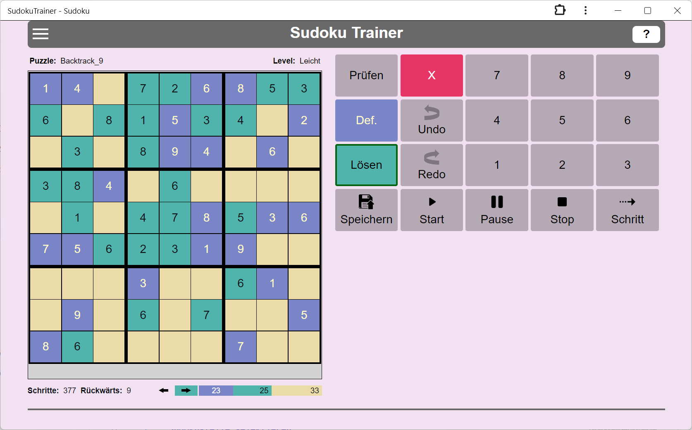
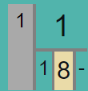

# Sudoku-Solver

Wer kennt das nicht? Beim Kaffee-Trinken ein Sudoku lösen. Nach jahrelanger Erfahrung ist man spürbar besser geworden. Und dann kommt ein Sudoku, manchmal auch nur als mittelschwer klassifiziert, und man findet einfach keine Lösung. Anstatt den Kaffee-Tisch frustriert zu verlassen, benutze diesen Sudoku-Solver. Er löst jedes Sudoku in wenigen Minuten und man kann ihm dabei zuschauen. Schritt für Schritt.

## Überblick

## Typischer Ablauf

1. **Sudoku eingeben:** "Definieren" wählen und die Zellen mit den Nummern der Sudoku-Aufgabe setzen.
2. **Sudoku lösen:** "Spielen" wählen und die Zellen mit den vermutet richtigen Nummern belegen.

In beiden Fällen besteht ein Spielschritt aus zwei Subschritten:

- Sudoku-Zelle selektieren.
- Nummer setzen: D.h. eine Nummer in der "Manuellen Ausführung" wählen.

Solltest Du eine Nummern-Setzung zurücknehmen wollen, so selektiere die betroffene Zelle und betätige die rote Lösch-Taste.

## Die möglichen Inhalte einer Sudoku-Zelle

|Zelle  |Bedeutung  |
|---------|---------|
||In dieser Zelle wurde während der Definitionsphase die Nummer 3 gesetzt.|
||In dieser Zelle wurde in der Spielphase manuell oder automatisch die Nummer 5 gesetzt. Wenn sie automatisch gesetzt wurde, wurde die automatische Ausführung des Solvers inzwischen gestoppt. Mit dem Stoppen der automatischen Ausführung wird in den Spielzellen die Information über die automatische Ausführung gelöscht.
||Der Solver hat in dieser Zelle automatisch die Nummer 9 gesetzt. Und zwar in der 17. Setzung einer Nummer. Die Wahl der zu setzenden Nummer war eindeutig.|
||Der Solver hat in dieser Zelle automatisch die Nummer 2 gesetzt. Und zwar in der 13. Setzung einer Nummer. Er musste zwischen den beiden Nummern 2 und 8 wählen. Der Solver wählt zunächst die Nummer 8. Wenn die Vervollständigung der Matrix gelingt, kommt die zweite Nummer nicht mehr zum Zuge. Gelingt die Vervollständigung nicht, kehrt der Automat zu dieser Zelle zurück und probiert die zweite Option 2. Die Optionen werden von rechts nach links abgearbeitet. Das Bild zeigt beide Optionen 8 und 2 als abgearbeitet. Noch nicht abgearbeitete Nummern werden in weißer Schrift angezeigt.|
||Für diese Zelle wurde noch keine Nummer gesetzt. Du kannst nur noch eine der Nummern 1, 2, 4 und 8 wählen. Wählst Du dennoch eine andere Nummer, kommt es zu einem Konflikt. Zwei gleiche Nummern in einer Spalte, Reihe oder Zellgruppe. Die betroffenen Zellen werden rot markiert.|
||Für diese Zelle wurde noch keine Nummer gesetzt. Ohne direkten Konflikt sind noch die drei Nummern 1, 5 und 8 setzbar. Jedoch hat der Solver ermittelt, dass die Nummer 5 notwendig ist, damit das Sudoku lösbar bleibt.|
||Für diese Zelle wurde noch keine Nummer gesetzt. Allerdings gibt es keine zulässige Nummer mehr, die noch gesetzt werden könnte. Wenn das Sudoku noch erfolgreich gelöst werden soll, müssen ein oder mehrere der bisherigen Nummernsetzungen zurückgenommen werden. Tritt während der automatischen Ausführung eine solche Zelle auf, schaltet der Solver in den Rückwärts-Modus um.|
||Für diese Zelle wurde noch keine Nummer gesetzt. Ohne direkten Konflikt sind noch die drei Nummern 5, 7 und 8 setzbar. Jedoch hat der Solver zwei notwendige Nummern für diese Zelle ermittelt: 5 und 7. Das geht natürlich nicht. Es können in einer Zelle nicht zwei Nummern gleichzeitig gesetzt werden. Wenn das Sudoku noch erfolgreich gelöst werden soll, müssen ein oder mehrere der bisherigen Nummernsetzungen zurückgenommen werden. Tritt während der automatischen Ausführung eine solche Zelle auf, schaltet der Solver in den Rückwärts-Modus um.|
||Für diese Zelle wurde die Nummer 8 gesetzt. Das führte zu einem Konflikt. Zwei gleiche Nummern in einer Spalte, Reihe oder Zellgruppe. Das zweite oder dritte Auftreten der Nummer wird ebenfalls rot angezeigt.|

## Unlösbare Gruppen

|    |    |
|----------|-----|
|| So wie es unlösbare Zellen geben kann - erkennbar an ihrem roten Hintergrund - so kann es auch unlösbare Gruppen geben. Eine Gruppe ist unlösbar, wenn nicht mehr alle Nummern 1 ... 9 in ihr vorkommen. Im Beispiel fehlt die Nummer 8. Tritt während der automatischen Ausführung eine solche Gruppe auf, schaltet der Solver in den Rückwärts-Modus um.

## Zwei Phasen

|Phase  |Bedeutung  |
|---------|---------|
||Die Taste **Definieren**. Das Drücken dieser Taste versetzt den Solver in die Definitionsphase. In dieser Phase überträgt man die zu lösende Sudoku-Aufgabe in den Solver.|
||Die Taste **Spielen**. Das Drücken dieser Taste versetzt den Solver in die Spielphase. Die Spielphase kann manuell oder automatisch durchgeführt werden.|

## Manuelle Ausführung

Die manuelle Ausführung wird in jedem Fall in der Definitionsphase genutzt. In der Spielphase ist sie optional. Die Spielphase kann alternativ auch automatisch durchgeführt werden.

## Automatische Ausführung

|Taste  |Bedeutung  |
|---------|---------|
||Die **Play-Taste**. Der Solver startet den automatischen Lösungssuchprozess. Zusätzlich wird ein Timer gestartet, der in der eingestellten Geschwindigkeit die Ausführung automatischer Suchschritte anstößt.|
||Die **Pause-Taste**. Der Taktgeber der automatischen Ausführung wird angehalten, nicht jedoch der Suchprozess abgebrochen. Der Spieler kann jetzt weitere automatische Suchschritte mit der Step-Taste von Hand anstoßen. Oder er kann durch das erneute Drücken der Play-Taste die getaktete automatische Ausführung fortsetzen.|
||Die **Stop-Taste**. Der Taktgeber der automatischen Ausführung wird angehalten und der aktuelle Suchprozess wird abgebrochen.|
||Die **Step-Taste**. Der Solver führt den nächsten automatischen Suchschritt aus. Falls noch nicht geschehen, startet er zuvor den Suchprozess überhaupt. Mit dieser Taste kann man den Solver Schritt für Schritt arbeiten lassen und so jeden einzelnen seiner Schritte zu verstehen suchen.|

## Initialisieren und Zurücksetzen

|Taste  |Bedeutung  |
|---------|---------|
||Die Taste **Initialisieren**. Durch das Drücken dieser Taste wird der Solver wird initialisiert. Danach ist die Sudoku-Tabelle leer.|
||Die Taste **Zurücksetzen**. Mittels dieser Taste wird der Solver zurückgesetzt auf die Aufgabenstellung. D.h. alle in der Spielphase gesetzten Zellen werden gelöscht. Die Zellen der Definitionsphase bleiben erhalten.|

## Spielstände speichern und wiederherstellen

Spielstände können im lokalen Speicher des Browsers gespeichert werden, nicht jedoch auf dem Computer selbst. Internet-Anwendungen ist es generell nicht gestattet, auf Inhalte des Computers zuzugreifen. D.h. Man kann seine gespeicherten Zustände nur in dem Browser wiederfinden, in dem sie gespeichert wurden.

|Taste  |Bedeutung  |
|---------|---------|
||Die Taste **Speichern unter...**. Mit dieser Taste kann der aktuelle Spielstand unter einem Namen gespeichert werden. Oft wird man den Zustand nach der Fertigstellung der Definition speichern wollen.|
||Die Taste **Wiederherstellen**. Mit Hilfe dieser Taste kann ein zuvor gespeicherter Zustand wiederhergestellt werden. Dabei wird der aktuelle Zustand gelöscht.|
||Die Taste **Löschen**. Mit dieser Taste kann ein gespeicherter Zustand  gelöscht werden.|

## Den Solver bei der Lösungssuche beobachten

Dieser Sudoku-Solver erlaubt es, ihm beim Suchen zuzusehen. Im Vorwärts-Modus führt er abwechselnd eine Zellselektion und eine Nummernsetzung durch, im Rückwärts-Modus, eine Zellselektion und eine Nummernlöschung. 
### Wie wählt der Solver die nächste Zelle und die in ihr zu setzende Nummer?

Der Solver sucht gemäß der folgenden Priorität die nächste offene Zelle:

1. **Zellen mit einer notwendigen Nummer:** Der Solver wählt in der Matrix zunächst die offenen Zellen, die in der Menge ihrer zulässigen Nummern eine notwendige Nummer haben. Diese notwendige Nummer wird dann in der Zelle gesetzt. Wenn es mehrere Zellen mit dieser Eigenschaft, wählt er die erste in seiner Liste.
1. **Zellen mit nur einer zulässigen Nummer**: Dann wählt er Zellen mit nur einer zulässigen Nummer. Denn auch für diese ist die Nummernsetzung eindeutig. Er setzt diese Nummer.
1. **Zellen mit minimaler Anzahl von zulässigen Nummern**. Sind keine eindeutigen Nummernsetzungen mehr verfügbar, wählt er Zellen mit minimaler Anzahl von zulässigen Nummern. In dieser Menge wählt er zufällig die Nummer, die er dann setzt. Im Laufe der weiteren Suche kann sich herausstellen, dass diese Nummer keine Lösung des Sudokus erlaubt. Der Back-Tracking-Prozess kehrt im weiteren Verlauf zu dieser Zelle zurück und versucht dann mit der Wahl einer anderen Nummer die Lösung zu finden.

### Wie prüft der Solver die neu gesetzte Nummer?

Der Solver prüft nach der Setzung einer neuen Nummer, ob das Sudoku mit dieser gesetzten Nummer unlösbar geworden ist. Falls ja, wird der Solver in den Rückwärts-Modus geschaltet und geht zurück bis zu einer Zelle, die mehrere Optionen für eine Nummernsetzung hatte. Wann ist nun ein Sudoku unlösbar? Ein Sudoku ist unlösbar in folgenden Situationen:

1. Ein **Zellkonflikt** tritt auf: zwei oder drei gleiche Nummern in einer Spalte, Zeile oder Gruppe. Die betroffenen Zellen werden rot unterlegt angezeigt.
1. **Keine zulässige Nummer mehr**: es gibt mindestens eine ungesetzte Zelle, für die es keine zulässige Nummer mehr gibt. Diese Zelle kann nicht mehr gesetzt werden. Eine solche Zelle ist leer und wird rot unterlegt angezeigt.
1. **Mehr als eine notwendige Nummer**: es gibt mindestens eine ungesetzte Zelle, in der mehr als eine Nummer als notwendig angezeigt wird. Das ist ein Widerspruch. Denn in einer Zelle können nicht mehrere Nummern gleichzeitig gesetzt werden. Eine solche Zelle wird rot unterlegt angezeigt.
1. **Unvollständige Zellgruppe**: Mindestens eine Zellgruppe ist unvollständig. Eine Zellgruppe ist unvollständig, wenn mindestens eine der Zahlen 1...9 in der Gruppe weder gesetzt ist noch in mindestens einer der noch ungesetzten Zellen als zulässige Nummer vorkommt. Eine solche Zellgruppe kann keine Lösung haben, da alle Ziffern 1...9 in einer gelösten Gruppe vorkommen müssen. Eine solche unvollständige Gruppe wird rot unterlegt angezeigt.

### Vorwärts und Rückwärts

Der Solver zeigt an, wie er im Suchprozess vorwärts und rückwärts geht. Im Fachjargon: Der Solver realisiert einen Back-Tracking-Algorithmus. Rückwärts muss er gehen, wenn die aktuell gesetzte Nummer zur Unlösbarkeit des Sudokus führt. Rückwärtsgehen bedeutet, dass der Solver der Reihe nach zuvor gesetzte Nummern wieder zurücknimmt, bis er auf eine Zelle trifft, in der er mehrere zulässigen Nummern zur Auswahl hatte. Er wählt dann die nächste noch nicht probierte Zahl der Auswahl und geht wieder in den Vorwärts-Modus. Sind alle zulässigen Nummern durchprobiert, geht er weiter rückwärts. Wenn er im Rückwärtsgehen bei der ersten gesetzten Zelle ankommt, hat das Sudoku keine Lösung.

Der Solver zeigt die aktuelle und die bisher maximal erreichte Suchtiefe an. Immer wenn er auf eine Zelle trifft, in der es keine eindeutige Nummernwahl gibt, erhöht er seine Suchtiefe.

## Erfolgreiche bzw. nicht erfolgreiche Suche

Der Suchprozess endet erfolgreich oder nicht erfolgreich. Er endet erfolgreich, sobald in allen Zellen eine zulässige Nummer gesetzt wurde. Wenn die Sudoku-Aufgabe keine Lösung besitzt, meldet der Solver: Keine Lösung gefunden. Die in Zeitungen und Magazinen gestellten Sudoku-Aufgaben sind in der Regel konsistent und eindeutig. D.h. sie besitzen überhaupt eine Lösung und diese Lösung ist eindeutig. Der Solver findet diese Lösung auf jeden Fall, und dies häufig mit weniger als 500 Schritten. In Einzelfällen sind aber auch mal bis zu 4000 Schritte und mehr notwendig, um eine Lösung zu finden.

Der Solver beherrscht auch Sudokus, die mehrere Lösungen haben. Nach der Erfolgsmeldung mit der ersten Lösung kann der Anwender nach der nächsten Lösung suchen lassen, solange bis der Solver meldet: Keine weitere Lösung gefunden.
