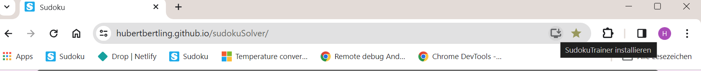
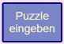
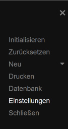
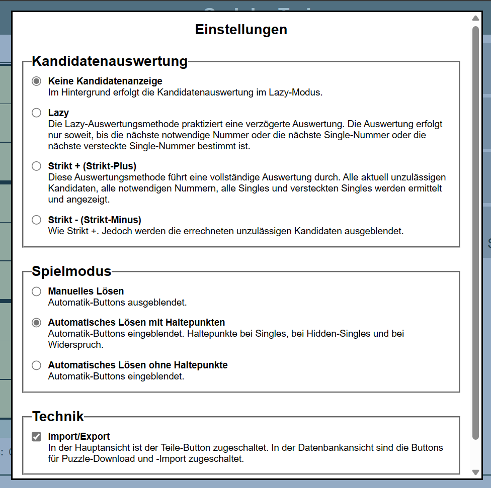
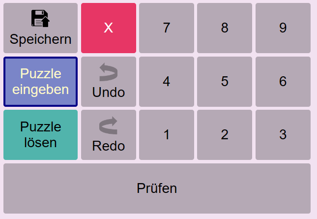
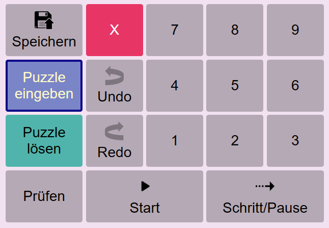
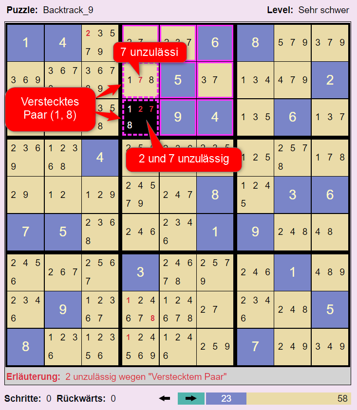
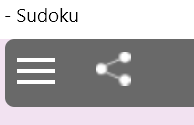

# Sudoku-Trainer

## Ein Trainer für klassisches Sudoku

Diese App ist ein Trainer für klassisches Sudoku. Der [Sudoku-Trainer](https://hubertbertling.github.io/sudokuSolver/) kann manuell oder automatisch genutzt werden. Seine Besonderheit: man kann ihm bei der automatischen Suche nach der Lösung zuschauen. Bei jeder automatischen Setzung einer Nummer zeigt der Solver den logischen Grund für die Setzung. Der Anwender kann ein Puzzle manuell lösen, oder er kann den Solver einen nächsten möglichen Schritt machen lassen. Es ist auch möglich, das Puzzle vollständig automatisch lösen zu lassen. Automatisch löst der Solver jedes Puzzle in wenigen Sekunden oder erkennt es als nicht lösbar (weil es widersprüchlich ist).

## Sudoku-Trainer Installation

Technisch gesehen ist die App Sudoku-Trainer eine progressive Web-App (PWA) . Als solche besitzt sie eine URL. Für die Installation benötigt man lediglich diese URL. Moderne Browser erkennen an der Manifest-Datei im Startverzeichnis, dass es sich um eine Web-App handelt, und zeigen die Möglichkeit der Installation an. Die Installation einer Web-App in einem Browser ist sehr einfach, siehe etwa [Installation-Web-App](https://support.google.com/chrome/answer/9658361?hl=de&co=GENIE.Platform%3DAndroid&oco=1). 

Sudoku-Trainer installieren:

1. Öffnen Sie auf Ihrem Android-Gerät den Browser Chrome.
1. Rufen Sie die Website (https://hubertbertling.github.io/sudokuSolver/) auf.

1. Tippen Sie auf Installieren.
1. Folgen Sie der Anleitung auf dem Bildschirm.

## App-Überblick

Der Sudoku-Trainer besteht aus drei Komponenten, dem Solver, dem Generator und der Puzzle-Datenbank. Mit Hilfe des Solvers kann man beliebige Sudoku-Puzzles manuell oder automatisch lösen.

Der Generator generiert faire Puzzles mit den Schwierigkeitsgraden 'Sehr leicht', 'Leicht', 'Mittel' und 'Schwer'. Im Gegensatz zu 'Sehr schweren' oder 'Extrem schweren' Puzzles können faire Puzzles allein durch logisches Schließen gelöst werden. Sie benötigen kein "Backtracking", kein Raten und Probieren.

Der Spielstand von Sudoku-Puzzles kann im lokalen Speicher des Browsers gespeichert werden. Die Tabelle (Datenbank) der gespeicherten Puzzles kann nach ihren Spalten sortiert werden.

## Sudoku-Puzzle

Die nachfolgend verwendeten Bezeichnungen sind im Laufe der Entwicklung dieses Trainers entstanden. Sie unterstützen primär das Verständnis dieses Trainers. Dennoch haben wir uns bemüht, Standardbegriffe zu verwenden, wie man sie im Internet findet, beispielsweise in [Wikipedia](https://en.wikipedia.org/wiki/Glossary_of_Sudoku). Eine herausragende Seite für Sudoku-Interessierte ist die Seite von [Andrew Stuart](https://www.sudokuwiki.org/Main_Page).

Ein Sudoku-Puzzle ist eine partiell gefüllte Tabelle. Die Tabelle hat 9 Reihen, 9 Spalten und 9 Blöcke. Die initial gesetzten Nummern heißen Givens. Sie werden blau unterlegt angezeigt. Grün unterlegte Zellen enthalten Lösungsnummern, die vom Spieler oder dem Solver gesetzt wurden. Die Tabelle besitzt Reihen, Spalten und Blöcke. Eine Reihe, eine Spalte oder ein Block wird auch als Gruppe bezeichnet.

Der Spieler kann sich bei der Lösungssuche unterstützen lassen, indem er in den noch nicht gesetzten Zellen Kandidatennummern anzeigen lässt. Kandidatennummern einer Zelle sind Nummern, die ohne Widerspruch gesetzt werden können. Damit die Kandidatennummern angezeigt werden, muss der Spieler in der Navigationsleiste die Option "Einstellungen" wählen und dort in dem Feld Kandidatenauswertung eine Option ungleich "Keine" selektieren, beispielsweise "Lazy". Weiter unten wird das Konzept der Kandidatenauswertung im Detail eingeführt.

## Typischer Ablauf der Lösung eines Sudoku-Puzzles

1. **Sudoku-Puzzle eingeben:** Taste "Puzzle eingeben" klicken und die Zellen mit den Givens des Puzzles setzen.
2. **Sudoku-Puzzle lösen:** Taste "Puzzle lösen" klicken und die Zellen mit den vermutet richtigen Nummern belegen.

Beim Eingeben wie auch beim Lösen besteht ein Lösungsschritt aus zwei Subschritten:

1. **Sudoku-Zelle selektieren**.
1. **Nummer setzen**: D.h. eine Nummer im rechten Tastenblock wählen. Es kann auch einfach nur eine Nummerntaste auf der Tastatur für die Eingabe einer Nummer benutzt werden.

Soll eine Nummern-Setzung zurückgenommen werden, muss die betroffene Zelle selektiert werden und dann die rote Lösch-Taste gedrückt werden.

## Die möglichen Inhalte einer Sudoku-Zelle

|Zelle  |Bedeutung  |
|---------|---------|
||**Eine gegebene Nummer (Given):** In der Definitionsphase gesetzte Nummer.|
||**Eine Lösungsnummer:** In der Lösungsphase gesetzte Nummer. In dieser Zelle wurde in der Lösungsphase manuell oder automatisch die Nummer 1 gesetzt.|
||**Kandidaten:** Für diese Zelle wurde noch keine Nummer gesetzt. Nur noch eine der Nummern 1, 2, 4 und 5 kann gewählt werden. Das sind die Kandidaten der Zelle. Die nicht aufgeführten Nummern sind direkt unzulässig, weil sie bereits in einer anderen Zelle des Blocks, der Reihe oder Spalte gesetzt sind.|
||**Notwendige Nummer:** Für die nebenstehende Zelle wurde noch keine Nummer gesetzt. Kandidatnummern sind die Nummern 2, 5, 6 und 7. Jedoch hat der Solver ermittelt, dass die Nummer 5 notwendig ist, damit das Sudoku lösbar bleibt. 5 ist eine notwendige Nummer für diese Zelle. Eine Nummer in einer Zelle ist notwendig, wenn die Nummer in ihrem Block, in ihrer Reihe oder Spalte einzig ist. D.h. sie kann nur noch hier gesetzt werden. Hinweis: Im Wikipedia-Artikel [Wikipedia](https://en.wikipedia.org/wiki/Glossary_of_Sudoku) werden notwendige Nummern werden als "Hidden Singles" bezeichnet. Wir wollen diese Bezeichnung hier nicht übernehmen, weil wir diese Bezeichnung schon anderweitig benutzen: siehe nachfolgende Definition 'Hidden Single'.|
||**Unzulässige Kandidatnummer:** Für die nebenstehende Zelle wurde noch keine Nummer gesetzt. Kandidaten dieser Zelle sind die drei Nummern 1, 3 und 6. Jedoch hat der Solver ermittelt, dass die 3 indirekt unzulässig ist. Wenn man sie setzen würde, würde der Solver sofort oder einige Schritte später die Widersprüchlichkeit des Puzzles feststellen. Zur Definition der Unzulässigkeit von Kandidaten siehe den entsprechenden Abschnitt dieser Hilfe.|
| | **Single:** Eine Single-Nummer ist der Kandidat in einer Zelle, wenn es keine weiteren Kandidaten in der Zelle gibt. In den beiden nebenstehenden Beispielen sind die 1 und die 9 Singles. Im Gegensatz zur 1 ist die 9 ein **Hidden Single**. Die 9 ist in dieser Zelle ein Hidden Single, weil die anderen Kandidaten, die rote 5 und 6, indirekt unzulässig sind. |
||**Widerspruch - Überhaupt keine zulässige Nummer:** Für diese Zelle wurde noch keine Nummer gesetzt. Allerdings gibt es keine Kandidatnummer mehr, die noch gesetzt werden könnte. Die Nummern 4 und 8 sind unzulässig. In der zweiten dargestellten Zelle gibt es nicht mal mehr Kandidatnummern. D.h. das Sudoku ist widersprüchlich. Wenn das Sudoku noch erfolgreich gelöst werden soll, müssen ein oder mehrere der bisherigen Nummernsetzungen zurückgenommen werden. Tritt während der automatischen Ausführung eine solche Zelle auf, schaltet der Solver in den Rückwärts-Modus um.|
||**Widerspruch - Gleichzeitig verschiedene notwendige Nummern:** Für diese Zelle wurde noch keine Nummer gesetzt. Kandidatnummern sind 1, 2 und 4. Jedoch hat der Solver zwei verschiedene notwendige Nummern für diese Zelle ermittelt: 1 und 2. Das geht natürlich nicht. Es können in einer Zelle nicht zwei Nummern gleichzeitig gesetzt werden. D.h. das Sudoku ist widersprüchlich. Wenn das Sudoku noch erfolgreich gelöst werden soll, müssen ein oder mehrere der bisherigen Nummernsetzungen zurückgenommen werden. Tritt während der automatischen Ausführung eine solche Zelle auf, schaltet der Solver in den Rückwärts-Modus um.|
||**Widerspruch - Die Nummer 5 ist bereits einmal gesetzt:** Für diese Zelle wurde die Nummer 5 gesetzt. Diese Nummer ist direkt unzulässig, weil in der Spalte, Reihe oder dem Block dieser Zelle bereits eine 5 gesetzt ist. Das zweite oder dritte Auftreten der Nummer wird ebenfalls mit rotem Rand angezeigt.|
||**Prüfen - Die Prüfung, aufgerufen durch die Prüfen-Taste, hat ergeben, dass die Nummer 5 falsch gesetzt ist:** Wenn ein Spieler manuell die Lösungsnummern setzt, kann er jederzeit mittels der Prüfen-Taste ermitteln, ob alle seine bisherigen gesetzten Lösungsnummern korrekt gesetzt sind. Alle nicht korrekten Setzungen werden wie der Widerspruch angezeigt. In diesem Beispiel hat die Prüfung ergeben, dass die 5 falsch gesetzt ist.|

## Zwei Spielphhasen

|Phase  |Bedeutung  |
|---------|---------|
||Die Taste **Puzzle eingeben**. Das Drücken dieser Taste versetzt den Solver in die Definitionsphase. In dieser Phase überträgt man das zu lösende Puzzle, sprich die Givens des Puzzles, in den Solver. Nach der Initialisierung ist diese Taste automatisch gesetzt.|
||Die Taste **Puzzles lösen**. Das Drücken dieser Taste versetzt den Solver in die Lösungsphase. Gleichzeitig ermittelt der Solver den Schwierigkeitsgrad des eingegebenen Puzzles. Die Lösungsphase kann manuell oder automatisch durchgeführt werden. Wird die automatische Ausführung gestartet, wird diese Taste automatisch gesetzt.|

Hinweis: Gegebene Nummern, die Givens - dies sind blaue Nummern - können in der Lösungsphase nicht gelöscht werden. Falls Givens gelöscht werden sollen, muss man zuvor die Definieren-Taste drücken.

## Manuelle Ausführung

Manuelle Ausführung bedeutet, dass der Spieler die Lösungsnummern (grün) in den Zellen setzt.
Will man sich der Herausforderung einer manuellen Lösungssuche ernsthaft stellen, kann man sich durch eine entsprechende Werkzeugeinstellung unterstützen lassen.

|Menü  |Einstellungen  |
|---------|---------|
|||

Indem man die Kandidatenauswertung auf 'Keine' setzt, wird die Kandidatenauswertung ausgeschaltet. Auf diese Weise kann man am Computer das Puzzle lösen wie auf einem Blatt Papier. Die zweite Einstellung, der Spielmodus "Trainieren", bewirkt, dass die Tasten für die automatische Ausführung ausgeblendet werden.

|Tastenauswahl Manuelle Ausführung|Tastenauswahl Automatische Ausführung|
|---------|---------|
|||

Wenn man beim  manuellen Lösen (Kandidatenauswertung = 'Keine') nicht weiterkommt, kann man die Schritttaste drücken. Dann selektiert der Solver die Zelle, die er als nächstes setzen würde. Meist ist dies eine Zelle, die eine notwendige Nummer besitzt. Drückt man die Schritttaste ein weiteres mal, wird die notwendige Nummer automatisch gesetzt.

Manuelles Lösen mit der Schritttaste ist Lösen mit "Vorsagen". Dies ist für Trainingszwecke sicher in Ordnung und nützlich. Ansonsten ist es aber offensichtlich eine eher unsportliche Art, ein Puzzle zu lösen.

## Automatische Ausführung

Die Lösungsphase kann alternativ auch automatisch durchgeführt werden. Die automatische Lösungssuche kann jederzeit mit der Start-Taste gestartet werden. So können auch bereits manuell teilweise gelöste Puzzles automatisch komplett gelöst werden. Für die automatische Ausführung muss in den Einstellungen der Spielmodus "Lösen" gewählt sein. Die Tasten der automatischen Ausführung haben folgende Bedeutung:

|Taste  |Bedeutung  |
|---------|---------|
|**Start**|Der Solver startet den automatischen Lösungssuchprozess. Zusätzlich wird ein Timer gestartet, der die Ausführung automatischer Suchschritte anstößt.|
|**Pause**|Der Taktgeber der automatischen Ausführung wird angehalten, nicht jedoch der Suchprozess abgebrochen. Der Spieler kann jetzt weitere automatische Suchschritte mit der Schritt-Taste von Hand anstoßen. Oder er kann durch das erneute Drücken der Start-Taste die getaktete automatische Ausführung fortsetzen.|
|**Stop**|Der Taktgeber der automatischen Ausführung wird angehalten und der aktuelle Suchprozess wird abgebrochen. In der Anzeige werden die Schrittinformationen ausgeblendet und nur noch die Lösungsnummern angezeigt.|
|**Schritt**|Der Solver führt den nächsten automatischen Suchschritt aus. Falls noch nicht geschehen, startet er zuvor den Suchprozess überhaupt. Mit dieser Taste kann man den Solver Schritt für Schritt arbeiten lassen und so jeden einzelnen seiner Schritte beobachten und verstehen.|

## Puzzle-Tasten

|Taste  |Bedeutung  |
|---------|---------|
|**Undo**|Durch das Drücken dieser Taste wird die letzte Zellenoperation zurückgenommen.|
|**Redo**|Rücknahme des Undo.|
|**Prüfen**|Die gesetzten Lösungsnummern werden geprüft. Wenn sie falsch gesetzt sind, werden sie als fehlerhaft gekennzeichnet. Diese Funktion ist dann nützlich, wenn man das Puzzle manuell lösen will und man vermutet, dass man bereits einen Fehler gemacht hat.
|**Speichern**|Mittels dieser Taste kann der Spielstand des aktuellen Puzzles in der Datenbank gespeichert werden. Gegebenenfalls wird das Puzzle in der DB neu angelegt.|

## Menü-Optionen

Durch Klicken der Menü-Taste im Header des Trainers öffnet sich die Menü-Leiste.

|Option  |Bedeutung  |
|---------|---------|
|**Initialisieren**|Durch das Drücken dieser Option wird das aktuelle Puzzle des Solvers initialisiert. Danach ist die Sudoku-Tabelle leer.|
|**Zurücksetzen**|Mittels dieser Option wird das Puzzle des Solvers zurückgesetzt auf die Aufgabenstellung. D.h. alle in der Lösungsphase gesetzten Zellen, die grünen Zellen, werden gelöscht. Die Givens bleiben erhalten.|
|**Neu/Sehr leicht**|Mittels dieser Option wird ein neues sehr leicht zu lösendes Puzzle generiert.|
|**Neu/Leicht**|Mittels dieser Option wird ein neues leicht zu lösendes Puzzle generiert.|
|**Neu/Mittel**|Mittels dieser Option wird ein neues mittel schwer zu lösendes Puzzle generiert.|
|**Neu/Schwer**|Mittels dieser Option wird ein neues schwer zu lösendes Puzzle generiert.|
|**Drucken**|Mittels dieser Option wird das aktuelle Puzzle ausgedruckt.|
|**Datenbank**|Mittels dieser Option wird der Datenbankdialog gestartet.|
|**Einstellungen**|Mittels dieser Option wird der Einstellungsdialog gestartet.|

## Kandidaten und unzulässige Nummern

Für eine noch nicht belegte Zelle der Sudoku-Tabelle unterscheiden wir Kandidatnummern und Nicht-Kandidatennummern. Nicht-Kandidatennummern bezeichen wir auch als unzulässge Nummern. Für eine unbelegte Zelle ist eine Nummer **direkt unzulässig**, wenn in dem Block, in der Reihe oder Spalte dieser Zelle eine andere Zelle existiert, in der diese Nummer bereits gesetzt ist. Alle anderen Nummern heißen **Kandidatnummern** oder einfach **Kandidaten** dieser Zelle. In einer unbelegten Zelle werden die Kandidaten der Zelle angezeigt, sofern im Feld Kandidatenauswertung nicht der Wert "Keine" gesetzt ist.

## Notwendige Nummern

Eine Kandidatnummer in einer Zelle ist notwendig, wenn die Nummer in ihrem Block, in ihrer Reihe oder Spalte einzig ist. D.h. sie kann nur hier gesetzt werden. Im Bild ist die grüne 1 notwendig, weil sie in ihrem Block kein weiteres mal zulässig ist. Im Lazy-Auswertungsmodus zeigt der Solver den die Notwendigkeit verursachenden Block, Spalte oder Reihe an, wenn man die Zelle mit der notwendigen Nummer selektiert hat. Die Zellen des Blocks besitzen einen grün gestrichelten Rahmen. Die Zellen mit den weiß gestrichelten Rahmen zeigen Einsen an, deretwegen in den grün gestrichelten Rahmen keine 1 mehr gesetzt werden kann.

## Unzulässige Kandidaten

**Direkt unzulässige Nummern** sind Nummern, die in einem Block, in einer Spalte oder Reihe bereits einmal existieren. Direkt unzulässige Nummern können keine Kandidaten sein. Es gibt jedoch auch unzulässige Kandidaten. **Unzulässige Kandidaten** werden in roter Schrift angezeigt. Eine Kandidatnummer ist (indirekt) unzulässig, wenn ihre Setzung in der Zelle das Puzzle widerspruchsvoll macht.

In fairen Puzzles kann man unzulässige Kandidaten allein durch logisches Schließen unter Anwendung definierter Kriterien ohne Backtracking erkennen. In der Literatur werden zahlreiche Kriterien genannt. Grundsätzlich ist die rein logische Erkennung der Unzulässigkeit von Kandidaten unvollständig. D.h. es gibt so schwere Puzzles, dass nicht alle unzulässigen Kandidaten mittels der Anwendung von logischen Kriterien erkannt werden können. Solche Sudokus können nur durch Backtracking gelöst werden. Der vorliegende Solver unterstützt nachfolgend beschriebene logische Kriterien für das Erkennen der Unzulässigkeit von Kandidaten. Falls diese für das Lösen eines konkreten Puzzles nicht ausreichen, löst der Solver das Puzzle durch Backtracking.

1. **Kriterium: Unzulässig wegen notwendiger Nummer.** Eine Kandidatnummer ist unzulässig wegen einer notwendigen Nummer, wenn sie in ihrer Spalte, Reihe oder ihrem Block auch als notwendige Nummer auftritt. Im nachfolgenden Beispiel sind die roten Nummern 1 wegen der grünen 1 unzulässig. Die grüne 1 ist notwendig, weil sie in ihrem Block einzig ist, also in dem Block kein weiteres mal zulässig ist.

1. **Kriterium: Unzulässig wegen "Nacktes Paar".** Eine Kandidatnummer ist unzulässig, wenn es in einem Block, einer Reihe oder Spalte Paare gibt und Nummern dieser Paare zusätzlich in weiteren Zellen dieses Blocks, dieser Spalte oder Reihe auftauchen. Im Beispiel ist das 2-8-Paar ein nacktes Paar. Das 2-8-Paar macht in seiner Spalte alle 2 und 8 unzulässig. Der Grund: Das Paar bedeutet, dass die 2 und die 8 auf jeden Fall in einer der beiden Zellen des Paares gesetzt werden muss. Aktuell steht nur noch nicht fest, ob die 2 oder die 8 oben ist. Fest steht aber jetzt schon, dass in den übrigen Zellen der Spalte keine 2 oder 8 mehr vorkommen können. Die 2 und 8 sind hier unzulässig. Diese Spaltendarstellung mit den gestrichelten Kanten zeigt der Solver nur im Lazy-Auswertungsmodus, wenn man eine Zelle mit unzulässigen Nummern selektiert hat.

1. **Kriterium: Unzulässig wegen "Verstecktes Paar".** In einem Block, einer Spalte oder Reihe kann es ein verstecktes Paar geben. Ein verstecktes Paar besteht aus zwei Zellen, die zwei gemeinsame Nummern haben, im Beispiel 1 und 8, die in den übrigen Zellen nicht vorkommen. Daneben können sie weitere Nummern haben. Am Ende können in diesen beiden Zellen nur die beiden Nummern 1 und 8 untergebracht werden. Deshalb müssen die übrigen Nummern der beiden Zellen eliminiert werden.

1. **Kriterium: Unzulässig wegen Überschneidung.** Ein Block und eine Spalte oder Reihe überschneiden sich. In der Reihe gibt es Nummern, die nur in den gemeinsamen Zellen mit dem Block auftauchen. Im Beispiel die 7. Damit es am Ende in der Reihe überhaupt eine 7 gibt, muss eine 7 in der Reihe gewählt werden. Dies wiederum bedeutet, dass die Nummern 7 in dem Block jenseits der Reihe gestrichen werden müssen.

## Methoden der Kandidatenauswertung

Unter Kandidatenauswertung verstehen wir die Anwendung der Kriterien, die im vorigen Abschnitt eingeführt wurden. Es müssen nicht immer alle Kriterien angewandt werden. Der Solver unterscheidet mehrere Methoden der Kandidatenauswertung.

1. **Keine** Kandidatenauswertung. Der Solver zeigt keine Kandidaten an, wenngleich er im Hintergrund weiter mit Kandidaten arbeitet. Diese Option ist wünschenswert, wenn der Spieler ohne Hilfe des Solvers eine manuelle Lösung des Puzzles suchen will.

1. **Lazy** Kandidatenauswertung. Wenn die Anzahl unzulässiger Kandidaten (die roten Nummern) groß wird, wird es immer schwieriger, nackte Paare oder versteckte Paare zu erkennen. Die Lazy-Auswertungsmethode praktiziert eine verzögerte Auswertung. Die Auswertung erfolgt nur soweit, bis die nächste notwendige Nummer oder die nächste Single-Nummer oder die nächste versteckte Single-Nummer bestimmt ist. Nur im Lazy-Modus, werden in den oben gezeigten Beispielen die Erläuterungen der Kandidatennummern angezeigt.

1. **Strikt +**: Diese Auswertungsmethode führt eine vollständige Auswertung durch. Alle aktuell unzulässigen Kandidaten, alle notwendigen Nummern, alle Singles und versteckten Singles werden ermittelt und angezeigt.

1. **Strikt -** : Wie Strikt +. Jedoch werden die errechneten unzulässigen Kandidaten ausgeblendet.

Das nachfolgende Bild zeigt ein Puzzle im Strikt-Plus-Auswertungsmodus. Bei genauerer Betrachtung dieses Beispiels fällt auf, dass in allen Zellen nur noch eine Nummer zulässig ist.

Das nachfolgende Bild zeigt die vorige Tabelle im Strikt-Minus-Modus. Im Strikt-Minus-Modus ist unmittelbar sichtbar, dass alle Zellen dieses Beispiels nur noch genau eine zulässige Nummer haben. Alle Nummern sind Singles. Mit anderen Worten: wir sehen hier die Lösung des Sudokus. Der Solver präsentiert hier eine Lösung ohne Backtracking. Nur die zuvor erläuterten Kriterien für unzulässige Kandidaten wurden angewandt.

## Vergleich der Auswertungsmodi Lazy und Strikt

Wir vergleichen die jeweiligen Vorteile der Auswertungsmodi.

**Vorteil der Lazy-Auswertung: Nachvollziehbarkeit des Lösungsweges.** Die Lazy-Auswertung ist vorteilhaft, wenn man den Lösungsweg im Einzelnen nachvollziehen will. Es werden nur unzulässige Kandidaten berechnet und angezeigt, die für den nächsten Schritt relevant sind. Für diese wenigen unzulässigen Kandidaten ist ihre Verursachung leicht visuell darstellbar und damit verstehbar.

Im Lazy-Modus wird die Verursachung notwendiger Nummern oder unzulässiger Kandidaten angezeigt durch gestrichelte Border, wenn die Zelle der notwendigen Nummer oder unzulässigen Nummer selektiert ist. Durch erneutes Klicken der selektierten Zelle können die Ursachen der notwendigen und unzulässigen Kandidaten der Reihe nach jeweils angezeigt werden. Wenn alle Kandidaten angezeigt wurden, führt das erneute Klicken der Zelle zur Deselektion der Zelle.

**Vorteil der strikten Auswertung: Lösung des Puzzles mit weniger Schritten.** Im Auswertungsmodus Strikt benötigt der Solver im Allgemeinen weniger Schritte bis zur Lösung des Puzzles als im Ausführungsmodus Lazy. Woran liegt das? Es liegt daran, dass der Solver im Ausführungsmodus Strikt sehr viel früher die Widersprüchlichkeit, falls vorhanden, der aktuellen Nummernbelegungen feststellt. Dies wiederum führt dazu, dass die Anzahl der Rückwärtsschritte entsprechend geringer wird und damit die Anzahl der Schritte insgesamt. Die Anzahl der Rückwärtsläufe bleibt in beiden Ausführungsmodi gleich. Der Solver untersucht in beiden Auswertungsmodi dieselben möglchen Nummernsetzungen.

Dieser Sudoku-Trainer zeichnet sich in erster Linie durch seine nachvollziehbare Lösungssuche aus. Die Schrittminimierung ist kein Ziel. Daher sind "Keine" bzw. "Lazy" der Default-Auswertungsmodus.

## Widerspruchsvolle Sudokus

Der automatische Solver setzt solange weitere Nummern in der Tabelle, bis er entweder alle Zellen gesetzt hat (das Sudoku ist gelöst), oder er erkennt, dass das Sudoku bei der aktuellen Befüllung widerspruchsvoll ist. Ein Sudoku-Puzzle ist widerspruchsvoll, wenn es

1. eine widerspruchsvolle Zelle besitzt, oder
1. eine widerspruchsvollen Gruppe.

Es können mehrere dieser Bedingungen gleichzeitig vorliegen. Der vorliegende Solver zeigt der Übersichtlichkeit halber immer nur eine Widerspruchsbedingung an.

## Widerspruchsvolle Zellen

Widerspruchsvolle Zellen hatten wir oben schon kennengelernt. Es sind dies Zellen ohne zulässige Kandidaten, Zellen mit zwei notwendigen Nummern gleichzeitig und Zellen, die mit einer direkt unzulässigen Nummer belegt sind.

## Widerspruchsvolle Gruppen

Wir betrachten hier die abstrakte Gruppe. Eine konkrete Gruppe ist immer entweder eine Reihe oder eine Spalte oder ein Block. So wie es widerspruchsvolle Zellen geben kann - erkennbar an ihrem roten Rand - kann es auch widerspruchsvolle Gruppen geben. Eine Gruppe ist widerspruchsvoll, wenn eine der folgenden Bedingungen vorliegt:

1. **Widerspruch - Zwei gleiche Singles:** Eine Nummer soll gleichzeitig in verschiedenen Zellen der Gruppe gesetzt werden wie die 4 im Beispiel.

1. **Widerspruch - Zwei gleiche notwendige Nummern:** In der Gruppe tritt dieselbe Nummer in verschiedenen Zellen als notwendig auf.
1. **Widerspruch - Fehlende Nummer:** In der Gruppe kommt eine Nummer überhaupt nicht vor.

Wir sehen, dass gleichzeitig mehrere Bedingungen für einen Gruppenwiderspruch vorliegen können. Tritt während der automatischen Ausführung eine solche widerspruchsvolle Gruppe auf, schaltet der Solver in den Rückwärts-Modus um.

## Die Lösungssuche des Solvers, Vorwärts und Rückwärts

Der Solver zeigt an, wie er im Suchprozess vorwärts und rückwärts geht. Im Fachjargon: Der Solver realisiert einen Backtracking-Algorithmus. Rückwärts muss er gehen, wenn die aktuell gesetzte Nummer zur Widersprüchlichkeit des Sudokus führt. Rückwärtsgehen bedeutet, dass der Solver der Reihe nach zuvor gesetzte Nummern wieder zurücknimmt, bis er auf eine Zelle trifft, in der er mehrere Kandidatnummern zur Auswahl hatte. Er wählt dann die nächste noch nicht probierte Zahl der Auswahl und geht wieder in den Vorwärts-Modus. Sind alle Kandidatnummern durchprobiert, geht er weiter rückwärts. Wenn er im Rückwärtsgehen bei der ersten gesetzten Zelle ankommt, und die erste Zelle keine weitere unprobierte Nummer mehr hat, hat das Sudoku keine Lösung.

Der Solver zeigt die Anzahl der zurückgelegten Schritte an. Jedes Setzen einer Zelle sowie die Rücknahme einer Setzung erhöht den Zähler um 1. Ebenso zeigt der Solver die Anzahl der Rückwärtsläufe an.

## Wie wählt der Solver die nächste Zelle und die in ihr zu setzende Nummer?

Der Solver sucht gemäß der folgenden Priorität die nächste offene Zelle und die zu setzende Nummer:

1. **Zelle mit notwendiger Nummer:** Der Solver wählt in der Tabelle zunächst eine offene Zelle, die in der Menge ihrer Kandidaten eine notwendige Nummer hat. Diese notwendige Nummer wird dann in der Zelle gesetzt.
1. **Zelle mit Single**: Wenn es keine Zelle mit notwendiger Nummer mehr gibt, wählt der Solver eine Zelle mit einer Single-Nummer. Er setzt diese Nummer.
1. **Zelle mit Hidden Single**: Wenn es keine Zelle mit notwendiger Nummer oder mit Single mehr gibt wählt der Solver eine Zelle mit Hidden Single.
1. **Zelle mit minimaler Optionenmenge**. Sind keine Zellen mit notwendigen Nummern oder Singles mehr verfügbar, wählt der Solver eine Zelle mit minimaler Anzahl von Kandidaten. Die sogenannten **Optionen der Zelle**. Meist besteht die minimale Optionenmenge aus zwei Optionen. Die Selektion ist aber nicht eindeutig, d.h. es gibt in der Regel mehrere Zellen mit zwei Optionen. In dieser Menge wählt der Solver zufällig eine Zelle und setzt eine der beiden Optionennummern. Im Laufe der weiteren Suche kann sich herausstellen, dass diese Nummer keine Lösung des Sudokus erlaubt. Der Backtracking-Prozess kehrt im weiteren Verlauf zu dieser Zelle zurück und versucht dann mit der Wahl einer anderen Nummer aus der Optionenmenge die Lösung zu finden.

## Wie prüft der Solver die neu gesetzte Nummer?

Der Solver prüft nach der Setzung einer neuen Nummer, ob das Sudoku mit dieser gesetzten Nummer widersprüchlich geworden ist. Falls ja, wird der Solver in den Rückwärts-Modus geschaltet und geht zurück bis zu einer Zelle, die mehrere Optionen für eine Nummernsetzung hatte.

## Sudoku-Schwierigkeitsgrade (Levels)

Der Schwierigkeitsgrad eines Sudoku-Puzzles kann auf verschiedene Weisen definiert werden. Wie beispielsweise anhand folgender Kriterien:

- Anzahl der Givens. (Wenige Givens = schwer, viele Givens = leicht).
- Erforderliche Zeit zum Lösen
- Komplexität der Lösungstechniken

Dieser Solver unterscheidet Schwierigkeitsgrade anhand der Komplexität der erforderlichen Lösungstechniken. Folgende Schwierigkeitsgrade werden unterschieden:

1. **Leicht:** Nur durch die Bestimmung **notwendiger Nummern** kann die Lösung des Sudokus erreicht werden.
1. **Sehr Leicht:** Wie Leicht, jedoch mit höherer Anzahl von Givens.
1. **Mittel:** Durch die Bestimmung notwendiger Nummern und **mindestens eines offenen Singles** kann die Lösung des Sudokus erreicht werden.
1. **Schwer:** Bei diesem Schwierigkeitsgrad benötigt der Solver **mindestens ein Hidden Single**. Für die Bestimmung von versteckten Singles müssen unzulässige Kandidaten (rot dargestellt) bestimmt werden. Dies unterscheidet diesen Schwierigkeitsgrad vom Schwierigkeitsgrad 'Mittel'. Zugleich ist dies der höchste Schwierigkeitsgrad, der ohne Backtracking auskommt.
1. **Sehr Schwer:** Bei diesem Schwierigkeitsgrad muss der Solver für mindestens eine Zelle eine Nummer raten und ausprobieren. "**Backtracking**" ist das dazugehörige Stichwort. Der Solver führt für die Berechnung der Lösung unter Umständen zahlreiche Rückwärtsläufe durch.
1. **Extrem Schwer**: 'Extrem schwer' sind Sudokus, die **mehrere Lösungen** haben. Sie haben keine eindeutige Lösung. Der Solver beherrscht auch Sudokus, die mehrere Lösungen haben. Nach der Erfolgsmeldung mit der ersten Lösung kann der Anwender nach der nächsten Lösung suchen lassen, solange bis der Solver meldet: "*Keine weitere Lösung gefunden*".

Extrem oder sehr schwere Sudokus eignen sich nicht für die manuelle Lösungssuche, da das notwendige Backtracking mit Papier und Bleistift durchgeführt werden müsste. Die in den Zeitungen oder Zeitschriften als 'Leicht', 'Mittel' oder 'Schwer' klassifizierten Sudoku-Puzzles sind meistens in dem hier dargestellten Sinn 'Leicht' oder 'Mittel'. Selten auch einmal 'Schwer'. D.h. die Zeitungs-Sudokus sind in der Regel fair. Sie können ohne Backtracking gelöst werden.

## Der Sudoku-Generator

Nahtlos integriert in den Sudoku-Trainer findet sich ein Sudoku-Generator. Mittels der Option **Neu** im Menu kann ein neues Puzzle generiert werden. Der Generator generiert nur faire Puzzles mit den Schwierigkeitsgraden 'Sehr leicht', 'Leicht', 'Mittel' und 'Schwer'. Im Gegensatz zu 'Sehr schweren' oder 'Extrem schweren' Puzzles können faire Puzzles allein durch logisches Schließen gelöst werden. Sie benötigen kein "Backtracking", kein Raten und Probieren.

## Die Puzzle-Datenbank

Sudoku-Puzzles und ihre Lösungen können im lokalen Speicher des Browsers gespeichert werden, nicht jedoch auf dem Computer selbst. Internet-Anwendungen können nicht auf das Datei-System des Computers zuzugreifen. D.h. Man kann seine gespeicherten Puzzles nur in dem Browser wiederfinden, in dem sie gespeichert wurden.

Beim Abspeichern erhält das gespeicherte Puzzle automatisch einen Namen, das aktuelle Datum. Bei Bedarf kann der Name umbenannt werden. Bezüglich der Namen gibt es keine Einschränkungen.

|Attribut  |Bedeutung  |
|---------|---------|
|Laufende Nr.|Laufende Nr. in der Tabelle. Sie ist keine ID für Puzzles|
|Puzzle-Name|Name des gespeicherten Puzzles. Muss nicht eindeutig sein.|
|#Givens|Die Zahl der Givens des Puzzles.|
|#Gelöste|Die Zahl der gelösten Zellen des Puzzles.|
|#Offene|Die Zahl der offenen, ungelösten Zellen des Puzzles.|
|Level|Der ermittelte Schwierigkeitsgrad des gespeicherten Puzzles.|
|#Rückwärts|Die Anzahl der Rückwärtsläufe, die der Solver durchgeführt hat, um das Puzzle zu lösen.|
|Datum|Datum, an dem das Puzzle zuletzt gespeichert wurde.

## Operationen der Datenbank

|Taste  |Bedeutung  |
|---------|---------|
|Spaltenkopf|**Sortieren.** Die Puzzles der Datenbank können sortiert werden nach jeder Spalte. Dazu einfach den Spaltenkopf klicken. Wiederholtes Klicken wechselt zwischen der aufsteigenden und der absteigenden Sortierung.|
|Pfeiltasten| **Navigieren.** Mit den Pfeiltasten kann in der Tabelle vorwärts und rückwärts navigiert werden. Durch Klicken auf eine Reihe der Tabelle kann ein Puzzle direkt selektiert werden.|
|Laden| **Puzzle laden.** Durch Drücken der Lade-Taste wird das selektierte Puzzle in den Sudoku-Solver geladen.|
|Löschen| **Puzzle löschen.** Gespeicherte Puzzles können auch wieder gelöscht werden.|
|Drucken| **Puzzle drucken.** Mittels der Taste Drucken kann das aktuell selektierte Puzzle gedruckt werden. Dabei wird nur die Aufgabe, nicht aber die Lösung ausgedruckt. Dies ist besonders dann nützlich wenn man ein generiertes Puzzle von Hand auf dem Papier lösen möchte. 
|Download Puzzle-DB|**Puzzle-Datenbank exportieren.** Durch Drücken dieser Taste wird die aktuelle Puzzle-Datenbank in ein txt-File 'Puzzle-DB.txt' ausgegeben. Es befindet sich im Download-Ordner.|
|Download Puzzle|**Puzzle exportieren.** Durch Drücken dieser Taste wird die aktuelle Puzzle mit dem Namen >>PuzzleName<<  in ein txt-File '>>PuzzleName<<.txt' ausgegeben. Es befindet sich im Download-Ordner.|
|Puzzle teilen |**Puzzle teilen.** Die Sudoku-Trainer-App ist Progressive Web App (PWA). Wie eine native App kann sie daher Inhalte, in unserem Fall ein Puzzle-File, mit anderen Apps teilen, z.B. mit WhatsApp oder einer EMAIL-App. Auf dem PC startet bei Doppel-Click auf diese Datei die Sudoku-App. Auf dem Android-SmartPhone ist dies leider noch nicht möglich.|

## Beispiele für das Teilen

## Puzzle vom SmartPhone zum PC

## Puzzle vom PC zum SmartPhone

## Puzzle vom SmartPhone zum SmartPhone

## Die initiale Datenbank ist nicht leer

Sie enthält zwei sehr schwere Puzzles. Also Puzzles, die nur durch Backtracking gelöst werden können. Der Einsteiger in diese App kann damit die automatische Lösungssuche dieses Trainers ausprobieren. In den Zeitungen und Zeitschriften findet man solche Puzzles nicht. Im Internet gibt es unter anderen diese bekannte Adresse [SoEinDing](https://sudoku.soeinding.de/sudokuExtraTeuflischSchwer.php), bei der man solche Puzzles finden kann.

## Sudoku-Trainer, eine App für den Gelegenheitsspieler

Eine herausragende Seite für Sudoku-Interessierte ist die Seite von [Andrew Stuart](https://www.sudokuwiki.org/Main_Page). Dort findest Du einen kompletten Überblick über logische Lösungsstrategien für klassisches Sudoku und auch einen Überblick über nicht klassische Sudoku-Varianten.

Stuarts Sudoku-Solver stellt die Anwendung logischer Lösungsstrategien in den Mittelpunkt. Ein Lösungsschritt besteht aus der Anwendung einer logischen Schlussregel. Das kann die Elimination von Kandidaten in mehreren Zellen sein aufgrund eines 'nackten Paares' oder die Setzung von 'versteckten Singles' (notwendigen Nummern) in mehreren Zellen gleichzeitig. Puzzles, die keine Lösung per logischem Schließen haben, löst der Solver (absichtlich) nicht. Echte Sudoku-Fans verzichten auf Backtracking.
Stuarts Sudoku-Solver richtet sich an Sudoku-Strategie-Experten bzw. an solche, die es werden wollen. 

Der von mir hier präsentierte Sudoku-Trainer wendet sich an Gelegenheits-Sudoku-Spieler, die ein Puzzle z.B. aus einer Zeitschrift lösen wollen. Sie bekommen auf jeden Fall eine Lösung ihres Puzzles sowie einen Schritt für Schritt Lösungsweg und den Schwierigkeitsgrad des eingegebenen Puzzles.

Mehr noch: dieser Solver zeigt notwendige Nummern, Singles und versteckte Singles an. Zusätzlich zeigt die App die Begründung einer notwendigen Nummer oder einer indirekt unzulässigen Nummer an. Der Spieler kann mit Hilfe dieser Funktionen seine Sudoku-Kompetenz trainieren. Gewöhnliche Sudoku-Solver liefern einfach nur die fertige Lösung eines Puzzles. Die vorliegende App ist damit nicht nur ein Sudoku-Solver sondern darüber hinaus ein Sudoku-Trainer.
