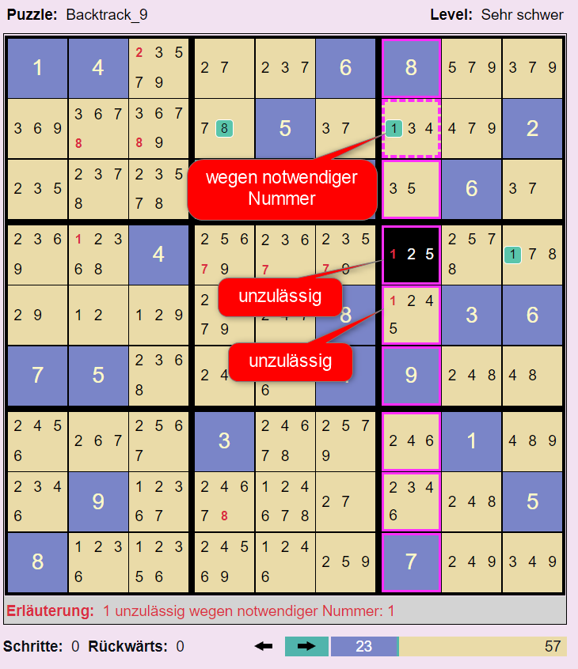

# Sudoku-App

Wer kennt das nicht? Beim Kaffeetrinken ein Sudoku lösen. Nach jahrelanger Erfahrung ist man spürbar besser geworden. Und dann kommt ein Sudoku, manchmal auch nur als mittelschwer klassifiziert, und man findet partout nicht die nächste Zelle mit einer eindeutigen Nummernbelegung. Anstatt den Kaffeetisch frustriert zu verlassen, kann man diese Sudoku-App und den darin enthaltenen Solver nutzen. Er löst jedes Sudoku in wenigen Minuten und man kann ihm dabei zuschauen. Schritt für Schritt kann man verstehen, wie der Solver zur Lösung des Sudokus gelangt.

Zusammen mit der Lösung bestimmt der Solver den tatsächlichen Schwierigkeitsgrad des Sudokus. Sehr schwere Sudokus, Definition siehe unten, sind manuell kaum zu lösen. Sie sollten daher kein Grund für Frust sein. Bei leichten und mittleren Sudokus lässt der Solver den eigenen Denkfehler erkennen oder er zeigt bei mangelnder Idee für den nächsten Schritt mögliche nächste Schritte. Konsequenz: Mit dieser Sudoku-App macht das Sudokulösen wieder Spaß.

## App-Überblick

Die App besteht aus zwei Komponenten, dem Sudoku-Solver und der Puzzle-Datenbank. Mit Hilfe des Sudoku-Solvers kann man beliebige Sudoku-Aufgaben, sprich Sudoku-Puzzles, manuell oder automatisch lösen. In der Puzzle-Datenbank können Puzzles und mit ihren Eigenschaften, etwa dem Schwierigkeitsgrad, den benötigten Lösungsschritten und der Lösung selbst gespeichert werden.

## Die Komponente Sudoku-Solver

Der Solver besteht im Wesentlichen aus der 9 x 9 Sudoku-Matrix. In den Zellen der Matrix können Nummern von 1 .. 9 gesetzt werden. um den Spieler zu unterstützen, werden für Zellen, die noch keine gesetzte Nummer haben, die aktuell noch möglichen Nummern der Zelle angezeigt. Zusätzlich werden die Zellen der Matrix in 3 x 3 Gruppen unterteilt, 9 an der Zahl.

### Typischer Ablauf der Lösung eines Sudoku-Puzzles

1. **Sudoku-Puzzle eingeben:** "Definieren" wählen und die Zellen mit den Nummern der Sudoku-Aufgabe setzen.
2. **Sudoku-Puzzle lösen:** "Spielen" wählen und die Zellen mit den vermutet richtigen Nummern belegen.

Beim Definieren wie auch beim Lösen besteht ein Spielschritt aus zwei Subschritten:

1. **Sudoku-Zelle selektieren**.
1. **Nummer setzen**: D.h. eine Nummer in der "Manuellen Ausführung" wählen.

Soll eine Nummern-Setzung zurückgenommen werden, muss die betroffene Zelle selektiert werden und dann die rote Lösch-Taste gedrückt werden.

### Die möglichen Inhalte einer Sudoku-Zelle

|Zelle  |Bedeutung  |
|---------|---------|
||**In der Definitionsphase gesetzte Nummer:** In dieser Zelle wurde während der Definitionsphase die Nummer 3 gesetzt.|
||**In der Spielphase gesetzte Nummer:** In dieser Zelle wurde in der Spielphase manuell oder automatisch die Nummer 5 gesetzt. Wenn sie automatisch gesetzt wurde, wurde die automatische Ausführung des Solvers inzwischen gestoppt. Mit dem Stoppen der automatischen Ausführung wird in den Spielzellen die Information über die automatische Ausführung gelöscht.
||**Automatisch gesetzte Nummer:** Der Solver hat in dieser Zelle automatisch die Nummer 2 gesetzt. Und zwar in der 17. Setzung einer Nummer. Die Wahl der zu setzenden Nummer war eindeutig. D.h. Die Nummer war eine notwendige Nummer oder ein Single. Definitionen siehe weiter unten.|
||**Automatisch gesetzte Nummer einer Auswahl:** Der Solver hat in dieser Zelle automatisch die Nummer 9 gesetzt. Und zwar in der 11. Setzung einer Nummer. Er musste zwischen den beiden Nummern 4 und 9 wählen. Der Solver wählt zunächst die Nummer 9. Wenn die Vervollständigung der Matrix gelingt, kommt die zweite Nummer nicht mehr zum Zuge. Gelingt die Vervollständigung nicht, kehrt der Automat zu dieser Zelle zurück und probiert die zweite Option 4. Die Optionen werden von rechts nach links abgearbeitet. Das Bild zeigt die Option 9 als abgearbeitet. Option 4 wurde noch nicht probiert. Noch nicht abgearbeitete Nummern werden in gelber Schrift angezeigt.|
||**Zulässige Nummern:** Für diese Zelle wurde noch keine Nummer gesetzt. Nur noch eine der Nummern 1, 3, 5 und 7 kann gewählt werden. Das sind die (noch) zulässigen Nummern der Zelle. Die nicht aufgeführten Nummern sind direkt unzulässig.|
||**Notwendige Nummer:** Für die nebenstehende Zelle wurde noch keine Nummer gesetzt. Ohne direkten Konflikt sind noch die drei Nummern 2, 5 und 8 setzbar. Jedoch hat der Solver ermittelt, dass die Nummer 8 notwendig ist, damit das Sudoku lösbar bleibt. 8 ist eine notwendige Nummer für diese Zelle. Eine Nummer in einer Zelle ist notwendig, wenn die Nummer in ihrer Gruppe, Zeile oder Spalte einzig ist. D.h. sie kommt in der betreffenden Gruppe, Zeile oder Spalte nur genau einmal vor. In der obigen Beispielmatrix ist die 8 einzig in ihrer Gruppe. Bei der Bestimmung notwendiger Nummern spielen indirekt unzulässige Nummern (rot markiert) keine Rolle.|
||**Indirekt unzulässige Nummer:** Für die nebenstehende Zelle wurde noch keine Nummer gesetzt. Ohne direkten Konflikt sind noch die drei Nummern 1, 7 und 8 setzbar. Jedoch hat der Solver ermittelt, dass die 7 indirekt unzulässig ist. Wenn man sie setzen würde, würde der Solver einige Schritte später die Unlösbarkeit des Puzzles feststellen. Zur Definition der indirekten Unzulässigkeit siehe den entsprechenden Abschnitt dieser Hilfe.|
|| **Singles:** Eine Single-Nummer ist eine zulässige Nummer in einer Zelle, wenn es keine weiteren zulässigen Nummern in der Zelle gibt. Im nebenstehenden Beispiel sind die 1 in der linken Zelle und die 7 in der rechten Zelle Singles. Die 7 bezeichnen wir auch als **direktes Single**, weil zu seiner Bestimmung nicht auf indirekt unzulässige Nummern zurückgegriffen werden muss. Im Gegensatz dazu ist die 1 ein **indirektes Single**. Die 1 ist ein Single, weil die rote 7 indirekt unzulässig ist.|
||**Leere Option:** Für diese Zelle wurde noch keine Nummer gesetzt. Allerdings gibt es keine zulässige Nummer mehr, die noch gesetzt werden könnte. D.h. das Sudoku ist unlösbar. Wenn das Sudoku noch erfolgreich gelöst werden soll, müssen ein oder mehrere der bisherigen Nummernsetzungen zurückgenommen werden. Tritt während der automatischen Ausführung eine solche Zelle auf, schaltet der Solver in den Rückwärts-Modus um.|
||**Widersprüchliche Notwendigkeit:** Für diese Zelle wurde noch keine Nummer gesetzt. Ohne direkten Konflikt sind noch die Nummern 1, 2, 3, 6, 7 und 8 setzbar. Jedoch hat der Solver zwei notwendige Nummern für diese Zelle ermittelt: 1 und 2. Das geht natürlich nicht. Es können in einer Zelle nicht zwei Nummern gleichzeitig gesetzt werden. D.h. das Sudoku ist unlösbar. Wenn das Sudoku noch erfolgreich gelöst werden soll, müssen ein oder mehrere der bisherigen Nummernsetzungen zurückgenommen werden. Tritt während der automatischen Ausführung eine solche Zelle auf, schaltet der Solver in den Rückwärts-Modus um.|
||**Direkt unzulässige Nummer:** Für diese Zelle wurde die Nummer 8 gesetzt. Diese Nummer ist direkt unzulässig, weil in der Spalte, Reihe oder Zellgruppe dieser Zelle bereits eine 8 gesetzt ist. Das zweite oder dritte Auftreten der Nummer wird ebenfalls rot unterlegt angezeigt.|
|| **Notwendig-Unzulässig-Widerspruch:** Das Violett der Nummer 3 bedeutet, dass die Nummer gleichzeitig notwendig und indirekt unzulässig ist. D.h. das Sudoku ist unlösbar. Wenn das Sudoku noch erfolgreich gelöst werden soll, müssen ein oder mehrere der bisherigen Nummernsetzungen zurückgenommen werden.|

### Zwei Phasen

|Phase  |Bedeutung  |
|---------|---------|
||Die Taste **Definieren**. Das Drücken dieser Taste versetzt den Solver in die Definitionsphase. In dieser Phase überträgt man die zu lösende Sudoku-Aufgabe in den Solver. Nach der Initialisierung ist diese Taste automatisch gesetzt.|
||Die Taste **Spielen**. Das Drücken dieser Taste versetzt den Solver in die Spielphase. Die Spielphase kann manuell oder automatisch durchgeführt werden. Wird die automatische Ausführung gestartet, wird diese Taste automatisch gesetzt.|

### Manuelle Ausführung

Die manuelle Ausführung wird in jedem Fall in der Definitionsphase genutzt. In der Spielphase ist sie optional. Die Spielphase kann alternativ auch automatisch durchgeführt werden.

### Automatische Ausführung

|Taste  |Bedeutung  |
|---------|---------|
||Die **Play-Taste**. Der Solver startet den automatischen Lösungssuchprozess. Zusätzlich wird ein Timer gestartet, der in der eingestellten Geschwindigkeit die Ausführung automatischer Suchschritte anstößt.|
||Die **Pause-Taste**. Der Taktgeber der automatischen Ausführung wird angehalten, nicht jedoch der Suchprozess abgebrochen. Der Spieler kann jetzt weitere automatische Suchschritte mit der Step-Taste von Hand anstoßen. Oder er kann durch das erneute Drücken der Play-Taste die getaktete automatische Ausführung fortsetzen.|
||Die **Stop-Taste**. Der Taktgeber der automatischen Ausführung wird angehalten und der aktuelle Suchprozess wird abgebrochen.|
||Die **Step-Taste**. Der Solver führt den nächsten automatischen Suchschritt aus. Falls noch nicht geschehen, startet er zuvor den Suchprozess überhaupt. Mit dieser Taste kann man den Solver Schritt für Schritt arbeiten lassen und so jeden einzelnen seiner Schritte verstehen.|

### Initialisieren und Zurücksetzen

|Taste  |Bedeutung  |
|---------|---------|
||Die Taste **Initialisieren**. Durch das Drücken dieser Taste wird der Solver wird initialisiert. Danach ist die Sudoku-Tabelle leer.|
||Die Taste **Zurücksetzen**. Mittels dieser Taste wird der Solver zurückgesetzt auf die Aufgabenstellung. D.h. alle in der Spielphase gesetzten Zellen werden gelöscht. Die Zellen der Definitionsphase bleiben erhalten.|
||Mittels dieser Taste kann das aktuelle Puzzle in der Datenbank gespeichert werden.|

## Theoretische Grundlagen des Solvers

### Indirekt unzulässige Nummern

Indirekt unzulässige Nummern spielen eine wichtige Rolle bei der Bestimmung der nächsten zu setzenden Nummer mittels indirekter Singles. Ebenso bilden sie die Grundlage für die frühe Erkennung der Widersprüchlichkeit eines Puzzles. Dazu später mehr. Indirekt unzulässige Nummern werden rot angezeigt. Wann ist eine Nummer indirekt unzulässig? Der vorliegende Solver kennt drei unterschiedliche Gründe.

1. **Indirekt unzulässig wegen einer notwendigen Nummer:** Eine Nummer ist indirekt unzulässig wegen einer notwendigen Nummer, wenn sie in ihrer Spalte, Reihe oder Gruppe auch als notwendige Nummer auftritt. Im nachfolgenden Beispiel sind die roten Nummern 8 wegen der grünen 8 indirekt unzulässig. Die grüne 8 ist notwendig, weil sie in ihrer Spalte einzig ist.

1. **Indirekt unzulässig wegen einer Single-Nummer:** Eine Nummer ist indirekt unzulässig wegen einer Single-Nummer, wenn sie in ihrer Spalte, Reihe oder Gruppe ein zweites mal als Single-Nummer auftritt.

1. **Indirekt unzulässig wegen Pairing:** Eine Nummer ist indirekt unzulässig, wenn es in einer Gruppe, Zeile oder Spalte Paare gibt und Nummern dieser Paare zusätzlich in weiteren Zellen dieser Gruppe, Spalte oder Zeile auftauchen. Im nachfolgenden Beispiel sind das 4-9-Paar und das 2-8-Paar kritische Paare. Das 4-9-Paar macht in seiner Gruppe alle 4 und 9 indirekt unzulässig. Ebenso in seiner Reihe. Das 2-8-Paar macht in seiner Spalte die rote 8 indirekt unzulässig. Die 2 in rechten Zelle ganz unten ist die nächste indirekte Single.

### Auswertungsmethoden

Die beiden Beispielmatrizen im vorigen Abschnitt zeigen den Solver in unterschiedlichen Auswertungsmodi. Im ersten Beispiel Strikt +, im zweiten Beispiel Lazy. Man sieht sofort, dass die Paarerkennung im Strikt-Modus wegen der Fülle indirekt unzulässiger Nummern nur noch schwer möglich ist. Abhilfe schafft hier die Lazy-Auswertung.

1. **Lazy Auswertung:** Diese Auswertungsmethode praktiziert eine verzögerte Auswertung. Die Auswertung erfolgt nur soweit, bis die nächste notwendige oder direkte oder indirekte Single-Nummer bestimmt ist. Diese Nummer wird dann gesetzt. Im Beispiel die 2 rechts unten.

1. **Strikte Auswertung:** Diese  Auswertungsmethode führt eine vollständige Auswertung durch: Alle aktuell indirekt unzulässigen Nummern, alle notwendigen Nummern, alle direkten Singles und indirekten Singles werden ermittelt. Danach können diese Nummern nach und nach gesetzt werden.

Die strikte Auswertung kann in zwei Varianten angezeigt werden:

1. **Strikt +**: Alle errechneten indirekt unzulässigen Nummern werden angezeigt.

1. **Strikt -** : Die errechneten indirekten unzulässigen Nummern werden ausgeblendet. Das nachfolgende Bild zeigt die vorige Matrix im Strikt-Minus-Modus. 

In der Strikt-Minus-Matrix dieses Beispiels besitzen alle Zellen nur noch genau eine zulässige Nummer. Alle Nummern sind Singles. Mit anderen Worten: wir sehen hier die Lösung des Sudokus. Der Solver präsentiert hier eine Lösung ohne Backtracking. Die meisten leichten und mittleren Sudokus in den Zeitschriften besitzen diese Eigenschaft der determinierten Lösungsfindung.

## Widerspruchsvolle Sudokus

Der automatische Solver setzt solange weitere Nummern in der Matrix, bis er entweder alle Zellen gesetzt hat (das Sudoku ist gelöst), oder er erkennt, dass das Sudoku bei der aktuellen Befüllung widerspruchsvoll ist. Ein Sudoku-Puzzle ist widerspruchsvoll, wenn es

1. eine widerspruchsvolle Zelle besitzt, oder
1. eine widerspruchsvolle Gruppe besitzt, oder
1. eine widerspruchsvolle Zeile besitzt, oder
1. eine widerspruchsvolle Spalte besitzt.

Es können mehrere dieser Bedingungen gleichzeitig vorliegen.

### Widerspruchsvolle Zellen

   

Widerspruchsvolle Zellen hatten wir oben schon kennengelernt. Es sind dies Zellen mit leerer Option, Zellen mit widersprüchlicher Notwendigkeit, Zellen mit direkt unzulässiger Nummer und Zellen mit einem Notwendig-Unzulässig-Widerspruch.

### Widerspruchsvolle Gruppen

So wie es widerspruchsvolle Zellen geben kann - erkennbar an ihrem roten Hintergrund - so kann es auch widerspruchsvolle Gruppen geben. Eine Gruppe ist widerspruchsvoll, wenn eine der folgenden Bedingungen vorliegt:

1. **Single-Widerspruch:** Eine Nummer soll gleichzeitig in verschiedene Zellen der Gruppe gesetzt werden wie die 3 im Beispiel.
1. **Pairing-Widerspruch:** Wegen des Paares {1 9} im nachfolgenden Beispiel dürfen weder die 1 noch die 9 ein weiteres mal in der Gruppe vorkommen. Im Beispiel kommt im Widerspruch dazu die 9 ein weiteres mal vor.

Tritt während der automatischen Ausführung eine solche widerspruchsvolle Gruppe auf, schaltet der Solver in den Rückwärts-Modus um.

### Widerspruchsvolle Zeilen und/oder Spalten

Es kann auch widerspruchsvolle Zeilen oder Spalten geben. Eine Spalte oder Zeile ist widerspruchsvoll (ganz analog zu der Definition für Gruppen), wenn eine der folgenden Bedingungen vorliegt:

1. **Single-Widerspruch**: Eine Nummer soll gleichzeitig in verschiedene Zellen der Zeile und/oder Spalte gesetzt werden wie die 8 im nachfolgenden Beispiel.
1. **Pairing-Widerspruch**: Bei Auftreten eines Paares dürfen die Nummern des Paares kein weiteres mal in der Zeile und/oder Spalte vorkommen.

## Den Solver beobachten

### Vorwärts und Rückwärts

Der Solver zeigt an, wie er im Suchprozess vorwärts und rückwärts geht. Im Fachjargon: Der Solver realisiert einen Back-Tracking-Algorithmus. Rückwärts muss er gehen, wenn die aktuell gesetzte Nummer zur Widersprüchlichkeit des Sudokus führt. Rückwärtsgehen bedeutet, dass der Solver der Reihe nach zuvor gesetzte Nummern wieder zurücknimmt, bis er auf eine Zelle trifft, in der er mehrere zulässigen Nummern zur Auswahl hatte. Er wählt dann die nächste noch nicht probierte Zahl der Auswahl und geht wieder in den Vorwärts-Modus. Sind alle zulässigen Nummern durchprobiert, geht er weiter rückwärts. Wenn er im Rückwärtsgehen bei der ersten gesetzten Zelle ankommt, hat das Sudoku keine Lösung.

Der Solver zeigt die Anzahl der zurückgelegten Schritte an. Jedes Setzen einer Zelle sowie die Rücknahme einer Setzung erhöht den Zähler um 1. Ebenso zeigt der Solver die Anzahl der Rückwärtsläufe und die bisher maximal erreichte Suchtiefe an. Immer wenn er auf eine Zelle trifft, in der es keine eindeutige Nummernwahl gibt, erhöht er seine Suchtiefe.

### Wie wählt der Solver die nächste Zelle und die in ihr zu setzende Nummer?

Der Solver sucht gemäß der folgenden Priorität die nächste offene Zelle und die zu setzende Nummer:

1. **Zelle mit notwendiger Nummer:** Der Solver wählt in der Matrix zunächst eine offene Zelle, die in der Menge ihrer zulässigen Nummern eine notwendige Nummer hat. Diese notwendige Nummer wird dann in der Zelle gesetzt.
1. **Zelle mit direkter Single**: Wenn es keine Zelle mit notwendiger Nummer mehr gibt, wählt der Solver eine Zelle mit nur einer zulässigen Nummer. Er setzt diese Nummer.
1. **Zelle mit indirekter Single**: Wenn es keine Zelle mit notwendiger Nummer oder mit direkter Single mehr gibt wählt der Solver eine Zelle mit indirekter Single.
1. **Zelle mit minimaler Optionenmenge**. Sind keine Zellen mit notwendigen Nummern oder Singles mehr verfügbar, wählt der Solver eine Zelle mit minimaler Anzahl von zulässigen Nummern. Die sogenannten Optionen der Zelle. In dieser Menge wählt er zufällig die Nummer, die er dann setzt. Im Laufe der weiteren Suche kann sich herausstellen, dass diese Nummer keine Lösung des Sudokus erlaubt. Der Back-Tracking-Prozess kehrt im weiteren Verlauf zu dieser Zelle zurück und versucht dann mit der Wahl einer anderen Nummer aus der Optionenmenge die Lösung zu finden.

### Wie prüft der Solver die neu gesetzte Nummer?

Der Solver prüft nach der Setzung einer neuen Nummer, ob das Sudoku mit dieser gesetzten Nummer widersprüchlich geworden ist. Falls ja, wird der Solver in den Rückwärts-Modus geschaltet und geht zurück bis zu einer Zelle, die mehrere Optionen für eine Nummernsetzung hatte.

### Unterschiedliche Schrittzahlen für die Ausführungsmodi Lazy und Strikt

Im Auswertungsmodus Lazy benötigt der Solver mehr Schritte bis zur Lösung des Puzzles als im Ausführungsmodus Strikt. Woran liegt das?

Es liegt daran, dass der Solver im Ausführungsmodus Strikt sehr viel früher die Widersprüchlichkeit der aktuellen Nummernbelegungen feststellt. Dies wiederum führt dazu, dass die Anzahl der Rückwärtsschritte entsprechend geringer wird und damit die Anzahl der Schritte insgesamt. Die Anzahl der Rückwärtsläufe bleibt gleich. Es werden dieselben Optionen geprüft.

Warum dann überhaupt die Lazy-Auswertung? Die Lazy-Auswertung ist interessant, wenn man den Lösungsvorgang im Einzelnen nachvollziehen will. Es werden nur indirekt unzulässige Nummern angezeigt, die für den nächsten Schritt relevant sind. Für diese wenigen indirekt unzulässigen Nummern ist ihre Verursachung erkennbar.

## Sudoku-Schwierigkeitsgrade (Level)

Wenn man bei der manuellen Lösung eines Sudokus nicht weiterkommt, kann man den vorliegenden Solver zur Hilfe nehmen. Ein Trost für das eigene Steckenbleiben könnte sein, dass der Solver einen höheren Schwierigkeitsgrad des Sudokus bestätigt. Dieser Solver unterscheidet folgende Schwierigkeitsgrade:

1. **Leicht:** Nur durch die Bestimmung notwendiger Nummern kann die Lösung des Sudokus erreicht werden.
1. **Mittel:** Durch die Bestimmung notwendiger Nummern und mindestens eines direkten Singles kann die Lösung des Sudokus erreicht werden.
1. **Schwer:** Bei diesem Schwierigkeitsgrad benötigt der Solver mindestens ein indirektes Single. Für die Bestimmung von indirekten Singles müssen indirekt unzulässige Nummern (rot dargestellt) bestimmt werden. Dies unterscheidet diesen Schwierigkeitsgrad vom Schwierigkeitsgrad Mittel.
1. **Sehr Schwer:** Bei diesem Schwierigkeitsgrad muss der Solver für mindestens eine Zelle eine Nummer raten und ausprobieren. "Trial and error" oder "Backtracking" sind die dazugehörigen Stichworte. Der Solver führt für die Berechnung der Lösung unter Umständen zahlreiche Rückwärtsläufe durch.
1. **Extrem Schwer**: Extrem schwer sind Sudokus, die mehrere Lösungen haben. Sie haben keine eindeutige Lösung. Der Solver beherrscht auch Sudokus, die mehrere Lösungen haben. Nach der Erfolgsmeldung mit der ersten Lösung kann der Anwender nach der nächsten Lösung suchen lassen, solange bis der Solver meldet: "*Keine weitere Lösung gefunden*".

Extrem oder sehr schwere Sudokus eignen sich nicht für die manuelle Lösungssuche. Die in den Zeitungen oder Zeitschriften als Leicht, Mittel oder Schwer klassifizierten Sudoku-Aufgaben sind meistens in dem hier dargestellten Sinn Leicht oder Mittel. Selten auch einmal schwer. D.h. die Zeitungs-Sudokus können in der Regel ohne Backtracking gelöst werden. Meist haben sie um die 30 bereits gesetzte Definitionszellen. Schwere Sudoku-Aufgaben beginnen mit 22 - 25 Definitionszellen. Bei noch geringerer Anzahl von Definitionszellen dürfte die Sicherstellung der eindeutigen Lösung nicht mehr erreichbar sein.

## Die Puzzle-Datenbank

Sudoku-Puzzles und ihre Lösungen können im lokalen Speicher des Browsers gespeichert werden, nicht jedoch auf dem Computer selbst. Internet-Anwendungen ist es generell nicht gestattet, auf den lokalen Speicher des Computers zuzugreifen. D.h. Man kann seine gespeicherten Puzzles nur in dem Browser wiederfinden, in dem sie gespeichert wurden.

Beim Abspeichern kann dem Puzzle ein Name gegeben werden. Automatisch erhält es eine eindeutige ID. Zusätzlich werden weitere Attribute für das gespeicherte Puzzle erfasst:

|Attribut  |Bedeutung  |
|---------|---------|
|Puzzle-ID|Die eindeutige ID des gespeicherten Puzzles|
|Definierte Zeilen|Die Zahl der der definierten Zeilen des Puzzles.|
|Status|Der Spielstatus des gespeicherten Puzzles.|
|Schritte (lazy)|Die Anzahl der Schritte, die der Solver brauchte, um das Puzzle im Auswertungsmodus Lazy zu lösen.|
|Schritte (strikt)|Die Anzahl der Schritte, die der Solver brauchte, um das Puzzle im Auswertungsmodus Strikt + bzw. Strikt - zu lösen.|
|Level|Der ermittelte Schwierigkeitsgrad des gespeicherten Puzzles.|
|#Rückwärts|Die Anzahl der Rückwärtsläufe, die der Solver durchgeführt hat, um das Puzzle zu lösen.|
|Datum|Datum, an dem das Puzzle zuletzt gespeichert wurde.

Die Puzzles der Datenbank können sortiert werden nach jeder Spalte. Dazu einfach den Spaltenkopf klicken. Wiederholtes Klicken wechselt zwischen der aufsteigenden und der absteigenden Sortierung.

Gespeicherte Puzzles können auch wieder gelöscht werden. Durch Drücken der Lade-Taste wird das selektierte Puzzle in den Sudoku-Solver geladen. Mit den Pfeiltasten kann in der Tabelle vorwärts und rückwärts navigiert werden. Durch Klicken auf eine Zeile der Tabelle kann ein Puzzle direkt selektiert werden.
