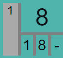
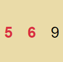
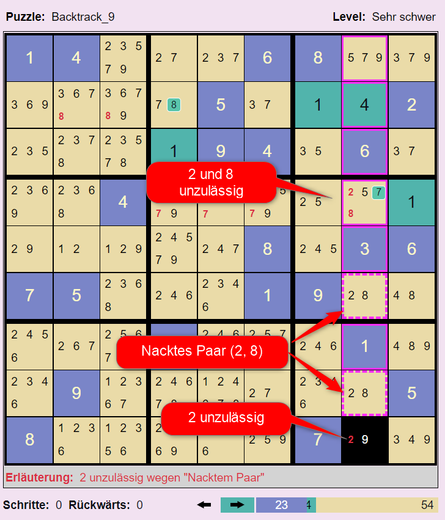
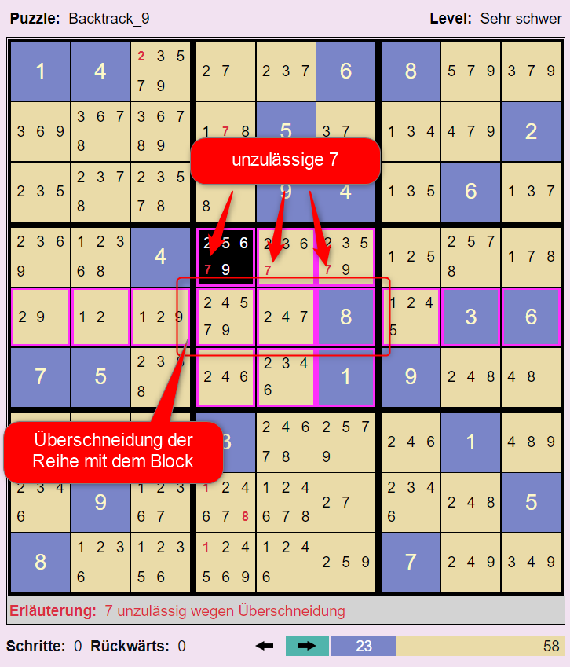
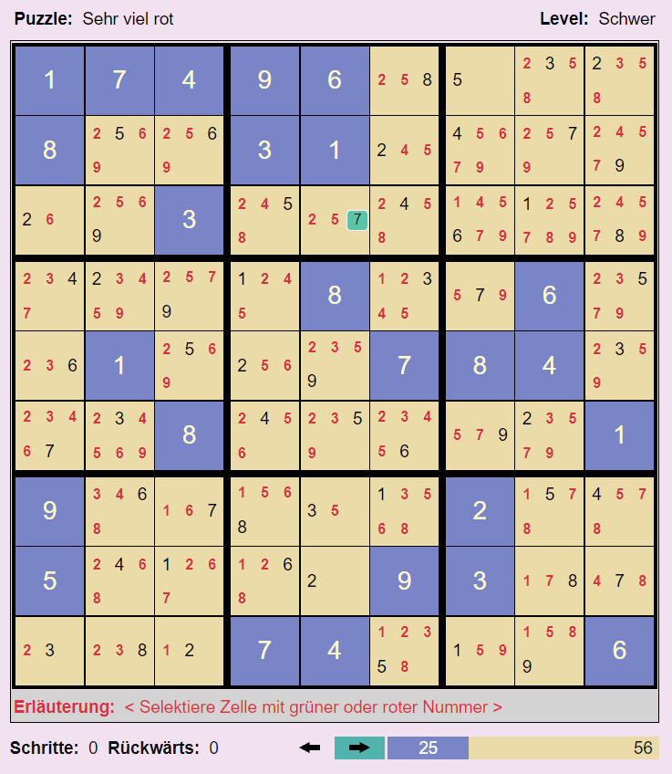
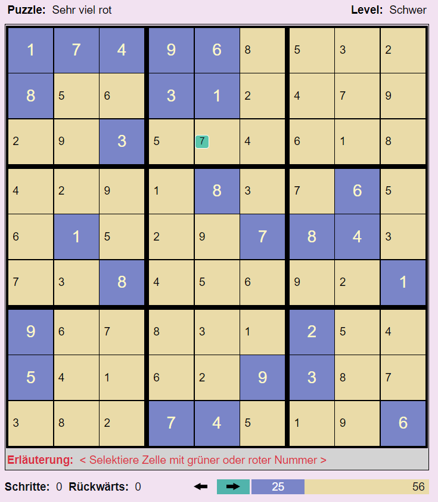
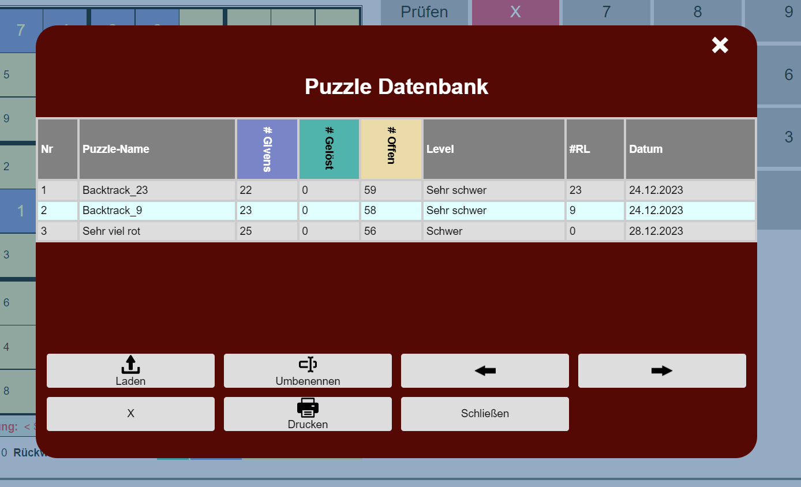

# HB-Sudoku-App

## Ein Generator und Solver für klassisches Sudoku

Wer kennt das nicht? Beim Kaffeetrinken ein Sudoku lösen. Nach jahrelanger Erfahrung ist man spürbar besser geworden. Und dann kommt ein Puzzle, manchmal sogar nur als leicht klassifiziert, und man findet partout nicht die nächste Zelle mit einer eindeutigen Nummernbelegung. Anstatt den Kaffeetisch frustriert zu verlassen, kann man die HB-Sudoku-App und den darin enthaltenen Solver nutzen. Er löst jedes Sudoku in wenigen Sekunden.

Das tun andere Sudoku-Solver auch. Die Besonderheit des HB-Sudoku-Solvers besteht darin, dass man ihm bei der Lösungssuche zuschauen kann. Schritt für Schritt kann man beobachten und verstehen, wie der Solver zur Lösung des Sudokus gelangt. Alternativ kann man sich auch einfach nur einen nächsten möglichen Schritt zeigen lassen und dann von Hand weitermachen.

Zusammen mit der Lösung bestimmt der Solver den tatsächlichen Schwierigkeitsgrad des Sudokus. Sehr schwere Sudokus - Definition siehe unten - sind manuell kaum zu lösen. Sie sollten daher kein Grund für Frust sein. Konsequenz: Mit der HB-Sudoku-App macht das Sudokulösen Spaß, auch wenn mal ein schweres Puzzle dabei ist.

Der Generator generiert faire Puzzles mit den Schwierigkeitsgraden Leicht, Mittel und Schwer. Im Gegensatz zu sehr schweren oder extrem schweren Puzzles - Definition der Schwierigkeitsgrade erfolgt weiter unten - können die generierten Puzzles allein durch logisches Schließen gelöst werden. Sie benötigen kein "Trial and Error", kein Raten und Probieren.

## App-Überblick

Die HB-Sudoku-App besteht aus zwei Komponenten, dem Sudoku-Solver/Generator und der Puzzle-Datenbank. Mit Hilfe des Sudoku-Solvers kann man beliebige Sudoku-Puzzles, manuell oder automatisch lösen. Mittels des Sudoku-Generators kann man neue Puzzles generieren. In der Puzzle-Datenbank können Puzzles mit ihren Eigenschaften, etwa dem Schwierigkeitsgrad, den benötigten Lösungsschritten und der Lösung selbst gespeichert werden.

## Der Sudoku-Solver

Ein Sudoku (oder auch Puzzle) ist eine partiell gefüllte Tabelle. Die Tabelle hat 9 Reihen, 9 Spalten und 9 Blöcke. Die initial gesetzten Nummern heißen Givens. Reihen, Spalten und Blöcke haben einen gemeinsamen Oberbegriff: Die Gruppe. Jede Reihe, Spalte und jeder Block ist eine Gruppe. Um den Spieler bei der Lösung zu unterstützen, werden für Zellen, die noch keine gesetzte Nummer haben, die aktuell noch möglichen Nummern, die Kandidaten der Zelle angezeigt.

### Typischer Ablauf der Lösung eines Sudoku-Puzzles

1. **Sudoku-Puzzle eingeben:** "Definieren" wählen und die Zellen mit den Givens des Puzzles setzen.
2. **Sudoku-Puzzle lösen:** "Lösen" wählen und die Zellen mit den vermutet richtigen Nummern belegen.

Beim Definieren wie auch beim Lösen besteht ein Lösungsschritt aus zwei Subschritten:

1. **Sudoku-Zelle selektieren**.
1. **Nummer setzen**: D.h. eine Nummer in "Manuell Lösen" wählen. Es kann auch einfach nur eine Nummerntaste für die Eingabe einer Nummer benutzt werden.

Soll eine Nummern-Setzung zurückgenommen werden, muss die betroffene Zelle selektiert werden und dann die rote Lösch-Taste gedrückt werden.

### Die möglichen Inhalte einer Sudoku-Zelle

|Zelle  |Bedeutung  |
|---------|---------|
||**Eine gegebene Nummer (Given):** In der Definitionsphase gesetzte Nummer.|
||**Eime Lösungsnummer:** In der Lösungsphase gesetzte Nummer. In dieser Zelle wurde in der Lösungsphase manuell oder automatisch die Nummer 5 gesetzt. Wenn sie automatisch gesetzt wurde, wurde die automatische Ausführung des Solvers inzwischen gestoppt. Mit dem Stoppen der automatischen Ausführung wird in den Lösungszellen die Information über die automatische Ausführung gelöscht.|
||**Automatisch gesetzte Nummer (Nummer eindeutig):** Der Solver hat in dieser Zelle automatisch die Nummer 5 gesetzt. Und zwar in der 8. Setzung einer Nummer in der Tabelle.. Die Wahl der zu setzenden Nummer war eindeutig. D.h. Die Nummer war eine notwendige Nummer oder ein Single. Definitionen siehe weiter unten.|
||**Automatisch gesetzte Nummer einer Auswahl (Erste Nummer von zwei Optionen):** Der Solver hat in dieser Zelle automatisch die Nummer 1 gesetzt. Und zwar in der 1. Setzung einer Nummer. Er musste zwischen den beiden Nummern 1 und 8 wählen. Der Solver wählt zunächst die Nummer 1. Wenn die Vervollständigung der Matrix gelingt, kommt die zweite Nummer nicht mehr zum Zuge. Gelingt die Vervollständigung nicht, kehrt der Automat zu dieser Zelle zurück und probiert die zweite Option 8. Die Option 8 wurde noch nicht probiert. Noch nicht abgearbeitete Nummern werden mit gelbem Hintergrund angezeigt.|
||**Automatisch gesetzte Nummer einer Auswahl (Erste Nummer von mehr als zwei Optionen):** Der Solver hat in dieser Zelle automatisch die Nummer 2 gesetzt. Und zwar in der 11. Setzung einer Nummer. Er musste zwischen den Nummern 2, 3 und noch weiteren hier nicht sichtbaren durch den Stern repräsentierten Nummern wählen. Der Solver wählt zunächst die Nummer 2. Wenn die Vervollständigung der Matrix gelingt, kommt die zweite Nummer nicht mehr zum Zuge. Gelingt die Vervollständigung nicht, kehrt der Automat zu dieser Zelle zurück und probiert die zweite Option 3. Nach und nach werden die nicht sichtbaren Optionen angezeigt. In der Praxis kommt der Versuch einer dritten Option so gut wie überhaupt nicht vor, weil zuvor schon eine Lösung gefunden wurde.|
||**Automatisch gesetzte Nummer einer Auswahl (Zweite Nummer von zwei Optionen):** Der Solver hat in dieser Zelle automatisch die Nummer 8 gesetzt. Und zwar in der 1. Setzung einer Nummer. Nachdem die erste Option 1 nicht zum Erfolg geführt hat, hat er die zweite Option 8 gewählt. Jetzt sind alle Optionen dieser Zelle abgearbeitet.|
||**Kandidaten:** Für diese Zelle wurde noch keine Nummer gesetzt. Nur noch eine der Nummern 1, 2, 4 und 5 kann gewählt werden. Das sind die Kandidaten der Zelle. Die nicht aufgeführten Nummern sind direkt unzulässig, weil sie bereits in einer anderen Zelle des Blocks, der Reihe oder Spalte gesetzt sind.|
||**Notwendige Nummer:** Für die nebenstehende Zelle wurde noch keine Nummer gesetzt. Kandidatnummern sind die Nummern 2, 5, 6 und 7. Jedoch hat der Solver ermittelt, dass die Nummer 5 notwendig ist, damit das Sudoku lösbar bleibt. 5 ist eine notwendige Nummer für diese Zelle. Eine Nummer in einer Zelle ist notwendig, wenn die Nummer in ihrem Block, in ihrer Reihe oder Spalte einzig ist. D.h. sie kann nur noch hier gesetzt werden. Hinweis: Im Wikipedia-Artikel [Wikipedia](https://en.wikipedia.org/wiki/Glossary_of_Sudoku) werden notwendige Nummern werden als "Hidden Singles" bezeichnet. Wir wollen diese Bezeichnung hier nicht übernehmen, weil wir diese Bezeichnung schon anderweitig benutzen. Wir bezeichnen eine Kandidatnummer einer Zelle als Verstecktes Single, wenn alle übrigen Kandidaten der Zelle unzulässig sind. Soweit richtig verstanden, gibt es für diese Konstellation im Wikipedia-Artikel keinen eigenen Begriff.|
||**Unzulässige Kandidatnummer:** Für die nebenstehende Zelle wurde noch keine Nummer gesetzt. Kandidaten dieser Zelle sind die drei Nummern 3, 6 und 8. Jedoch hat der Solver ermittelt, dass die 3 indirekt unzulässig ist. Wenn man sie setzen würde, würde der Solver sofort oder einige Schritte später die Widersprüchlichkeit des Puzzles feststellen. Zur Definition der Unzulässigkeit von Kandidaten siehe den entsprechenden Abschnitt dieser Hilfe.|
| | **Single:** Eine Single-Nummer ist ein Kandidat in einer Zelle, wenn es keine weiteren Kandidaten in der Zelle gibt. In den beiden nebenstehenden Beispielen sind die 6 und die 9 Singles. Im Gegensatz zur 6 ist die 9 ein **Verstecktes Single**. Die 9 ist in dieser Zelle ein verstecktes Single, weil die anderen Kandidaten, die rote 5 und 7, indirekt unzulässig sind. Hinweis: [Andrew Stuart](https://www.sudokuwiki.org/Main_Page). bezeichnet Singles als 'Solved Cells'.|
||**Widerspruch - Überhaupt keine zulässige Nummer:** Für diese Zelle wurde noch keine Nummer gesetzt. Allerdings gibt es keine Kandidatnummer mehr, die noch gesetzt werden könnte. Die Nummern 4, 8 und 9 sind unzulässig. In der zweiten dargestellten Zelle gibt es nicht mal mehr Kandidatnummern. D.h. das Sudoku ist widersprüchlich. Wenn das Sudoku noch erfolgreich gelöst werden soll, müssen ein oder mehrere der bisherigen Nummernsetzungen zurückgenommen werden. Tritt während der automatischen Ausführung eine solche Zelle auf, schaltet der Solver in den Rückwärts-Modus um.|
||**Widerspruch - Gleichzeitig verschiedene notwendige Nummern:** Für diese Zelle wurde noch keine Nummer gesetzt. Kandidatnummern sind 5, 7 und 9. Jedoch hat der Solver zwei verschiedene notwendige Nummern für diese Zelle ermittelt: 7 und 9. Das geht natürlich nicht. Es können in einer Zelle nicht zwei Nummern gleichzeitig gesetzt werden. D.h. das Sudoku ist widersprüchlich. Wenn das Sudoku noch erfolgreich gelöst werden soll, müssen ein oder mehrere der bisherigen Nummernsetzungen zurückgenommen werden. Tritt während der automatischen Ausführung eine solche Zelle auf, schaltet der Solver in den Rückwärts-Modus um.|
||**Widerspruch - Die Nummer 3 ist bereits einmal gesetzt:** Für diese Zelle wurde die Nummer 3 gesetzt. Diese Nummer ist direkt unzulässig, weil in der Spalte, Reihe oder dem Block dieser Zelle bereits eine 3 gesetzt ist. Das zweite oder dritte Auftreten der Nummer wird ebenfalls mit rotem Rand angezeigt.|

### Zwei Phasen

|Phase  |Bedeutung  |
|---------|---------|
||Die Taste **Definieren**. Das Drücken dieser Taste versetzt den Solver in die Definitionsphase. In dieser Phase überträgt man das zu lösende Puzzle, sprich die Givens des Puzzles, in den Solver. Nach der Initialisierung ist diese Taste automatisch gesetzt.|
||Die Taste **Lösen**. Das Drücken dieser Taste versetzt den Solver in die Lösungsphase. Die Lösungsphase kann manuell oder automatisch durchgeführt werden. Wird die automatische Ausführung gestartet, wird diese Taste automatisch gesetzt.|

Hinweis: Gegebene Nummern, die Givens - dies sind blaue Nummern - können in der Lösungsphase nicht gelöscht werden. Falls Givens gelöscht werden sollen, muss man zuvor die Definieren-Taste drücken.

### Manuelle Ausführung

Die manuelle Ausführung wird in jedem Fall in der Definitionsphase genutzt. In der Lösungsphase ist sie optional. Die Lösungsphase kann alternativ auch automatisch durchgeführt werden.

### Automatische Ausführung

|Taste  |Bedeutung  |
|---------|---------|
|**Start**|Der Solver startet den automatischen Lösungssuchprozess. Zusätzlich wird ein Timer gestartet, der in der eingestellten Geschwindigkeit die Ausführung automatischer Suchschritte anstößt.|
|**Pause**|Der Taktgeber der automatischen Ausführung wird angehalten, nicht jedoch der Suchprozess abgebrochen. Der Spieler kann jetzt weitere automatische Suchschritte mit der Schritt-Taste von Hand anstoßen. Oder er kann durch das erneute Drücken der Start-Taste die getaktete automatische Ausführung fortsetzen.|
|**Stop**|Der Taktgeber der automatischen Ausführung wird angehalten und der aktuelle Suchprozess wird abgebrochen.|
|**Schritt**|Der Solver führt den nächsten automatischen Suchschritt aus. Falls noch nicht geschehen, startet er zuvor den Suchprozess überhaupt. Mit dieser Taste kann man den Solver Schritt für Schritt arbeiten lassen und so jeden einzelnen seiner Schritte beobachten und verstehen.|

### Puzzle-Operationen

|Taste  |Bedeutung  |
|---------|---------|
|**Initialisieren**|Durch das Drücken dieser Taste wird das aktuelle Puzzle des Solvers initialisiert. Danach ist die Sudoku-Tabelle leer.|
|**Zurücksetzen**|Mittels dieser Taste wird das Puzzle des Solvers zurückgesetzt auf die Aufgabenstellung. D.h. alle in der Lösungsphase gesetzten Zellen, die grünen Zellen, werden gelöscht. Die Givens bleiben erhalten.|
|**Neues Puzzle**|Mittels dieser Taste kann ein neues Puzzle generiert werden.|
|**Puzzle speichern**|Mittels dieser Taste kann das aktuelle Puzzle in der Datenbank gespeichert werden.|
|**Puzzle-Daten aktualisieren**|Mittels dieser Taste kann für ein aus der Datenbank geladenes Puzzle das neue Ausführungsergebnis gespeichert werden. Falls das aktuelle Puzzle nicht aus der Datenbank geladen wurde, wird der Speicherdialog angestoßen.|

## Basisbegriffe des Solvers

Die hier verwendeten Begriffe sind im Laufe der Entwicklung dieses Solvers entstanden. Sie unterstützen primär das Verständnis dieses Solvers. Dennoch haben wir uns bemüht, Standardbegriffe zu verwenden, wie man sie im Internet findet, beispielsweise in [Wikipedia](https://en.wikipedia.org/wiki/Glossary_of_Sudoku). Eine herausragende Seite für Sudoku-Interessierte ist die Seite von [Andrew Stuart](https://www.sudokuwiki.org/Main_Page).

### Kandidaten und unzulässige Nummern

Für eine noch nicht belegte Zelle der Sudoku-Tabelle unterscheiden wir Kandidatnummern und unzulässge Nummern. Für eine unbelegte Zelle ist eine Nummer **unzulässig**, wenn in dem Block, in der Reihe oder Spalte dieser Zelle eine andere Zelle existiert, in der diese Nummer gesetzt ist. Alle anderen Nummern heißen **Kandidatnummern (Candidates)** oder einfach **Kandidaten** dieser Zelle. In einer unbelegten Zelle werden die Kandidaten der Zelle angezeigt.

### Notwendige Nummern

Eine Kandidatnummer in einer Zelle ist notwendig, wenn die Nummer in ihrem Block, in ihrer Reihe oder Spalte einzig ist. D.h. sie kann nur hier gesetzt werden. Im Bild ist die grüne 1 notwendig, weil sie in ihrer Zeile kein weiteres mal zulässig ist. Im Lazy-Auswertungsmodus zeigt der Solver den die Notwendigkeit verursachenden Block, Spalte oder Reihe an, wenn man die Zelle mit der notwendigen Nummer selektiert hat. Die roten Pfeile zeigen für jede offene Zelle der Zeile, warum in ihnen die 1 unzulässig ist. 

Hinweis: Im Wikipedia.Artikel [Wikipedia](https://en.wikipedia.org/wiki/Glossary_of_Sudoku) werden notwendige Nummern werden als "Hidden Singles" bezeichnet. Wir wollen diese Bezeichnung hier nicht übernehmen, weil wir diese Bezeichnung schon anderweitig benutzen. Wir bezeichnen eine Kandidatnummer einer Zelle als Verstecktes Single, wenn alle übrigen Kandidaten der Zelle unzulässig sind.

### Unzulässige Kandidaten

**Unzulässige Nummern** sind Nummern, die in einem Block, in einer Spalte oder Zeile bereits einmal existieren. In einer ungesetzten Zelle werden die  unzulässigen Nummern nicht angezeigt. Anders dagegen unzulässige Kandidaten. **Unzulässige Kandidaten** werden rot angezeigt. Eine Kandidatnummer ist (indirekt) unzulässig, wenn ihre Setzung in der Zelle das Puzzle widerspruchsvoll macht. 

In fairen Puzzles kann man unzulässige Kandidaten allein durch logisches Schließen unter Anwendung definierter Kriterien ohne Backtracking erkennen. In der Literatur werden zahlreiche Kriterien genannt. Grundsätzlich ist die rein logische Erkennung der Unzulässigkeit von Kandidaten unvollständig. D.h. es gibt so schwere Puzzles, dass nicht alle unzulässigen Kandidaten mittels der Anwendung von Kriterien erkannt werden können. Solche Sudokus können nur durch Backtracking gelöst werden. Der vorliegende Solver unterstützt nachfolgend beschriebene Kriterien für das Erkennen der Unzulässigkeit von Kandidaten. Falls diese für das Lösen eines konkreten Puzzles nicht ausreichen, löst der Solver das Puzzle durch Backtracking.

1. **Kriterium: Unzulässig wegen notwendiger Nummer.** Eine Kandidatnummer ist unzulässig wegen einer notwendigen Nummer, wenn sie in ihrer Spalte, Reihe oder ihrem Block auch als notwendige Nummer auftritt. Im nachfolgenden Beispiel sind die roten Nummern 1 wegen der grünen 1 unzulässig. Die grüne 1 ist notwendig, weil sie in ihrer Zeile einzig ist, also in der Zeile kein weiteres mal zulässig ist.

1. **Kriterium: Unzulässig wegen "Nacktes Paar".** Eine Kandidatnummer ist unzulässig, wenn es in einem Block, einer Zeile oder Spalte Paare gibt und Nummern dieser Paare zusätzlich in weiteren Zellen dieses Blocks, dieser Spalte oder Zeile auftauchen. Im nachfolgenden Beispiel ist das 2-8-Paar ein nacktes Paar. Das 2-8-Paar macht in seiner Spalte alle 2 und 8 unzulässig. Der Grund: Das Paar bedeutet, dass die 2 und die 8 auf jeden Fall in einer der beiden Zellen des Paares gesetzt werden muss. Aktuell steht nur noch nicht fest, ob die 2 oder die 8 oben ist. Fest steht aber jetzt schon, dass in den übrigen Zellen der Spalte keine 2 oder 8 mehr vorkommen können. Die 2 und 8 sind hier unzulässig. Diese Spaltendarstellung mit den gestrichelten Kanten zeigt der Solver nur im Lazy-Auswertungsmodus, wenn man eine Zelle mit unzulässigen Nummern selektiert hat.

1. **Kriterium: Unzulässig wegen "Verstecktes Paar".** In einem Block, einer Spalte oder Zeile kann es ein verstecktes Paar geben. Ein verstecktes Paar besteht aus zwei Zellen, die zwei gemeinsame Nummern haben, im Beispiel 1 und 8, die in den übrigen Zellen nicht vorkommen. Daneben können sie weitere Nummern haben. Am Ende können in diesen beiden Zellen nur die beiden Nummern 1 und 8 untergebracht werden. Deshalb müssen die übrigen Nummern der beiden Zellen eliminiert werden.

1. **Kriterium: Unzulässig wegen Überschneidung.** Ein Block und eine Spalte oder Zeile überschneiden sich. In der Spalte gibt es Nummern, die nur in den gemeinsamen Zellen mit dem Block auftauchen. Im Beispiel die 7. Damit es am Ende in der Spalte überhaupt eine 7 gibt, muss eine 7 in der Spalte gewählt werden. Dies wiederum bedeutet, dass die Nummern 7 in dem Block neben der Spalte gestrichen werden müssen.

### Auswertungsmethoden

Wenn die Anzahl unzulässiger Kandidaten (die roten Nummern) groß wird, wird es immer schwieriger, nackte Paare oder versteckte Paare zu erkennen. Siehe das nachfolgende Beispiel.

Abhilfe schafft hier die Lazy-Auswertung.

1. **Lazy Auswertung:** Diese Auswertungsmethode praktiziert eine verzögerte Auswertung. Die Auswertung erfolgt nur soweit, bis die nächste notwendige Nummer oder die nächste Single-Nummer oder die nächste versteckte Single-Nummer bestimmt ist. Nur im Strikt-Modus, sind die oben gezeigten Beispiele mit ihren Erläuterungen der Kandidatennummern möglich.

1. **Strikte Auswertung:** Diese  Auswertungsmethode führt eine vollständige Auswertung durch: Alle aktuell unzulässigen Kandidaten, alle notwendigen Nummern, alle Singles und versteckten Singles werden ermittelt.

Die strikte Auswertung kann in zwei Varianten angezeigt werden:

1. **Strikt +**: Alle errechneten unzulässigen Kandidaten werden angezeigt (in roter Schrift). Bei sehr vielen unzulässigen Kandidaten wird das schnell sehr unübersichtlich, siehe das vorige Beispiel.

1. **Strikt -** : Die errechneten unzulässigen Kandidaten werden ausgeblendet. Das nachfolgende Bild zeigt die vor vorige Tabelle mit dem Puzzle-Namen 'Schwer 2 Singles' im Strikt-Minus-Modus. 

In der Strikt-Minus-Tabelle dieses Beispiels besitzen alle Zellen nur noch genau eine zulässige Nummer. Alle Nummern sind Singles. Mit anderen Worten: wir sehen hier die Lösung des Sudokus. Der Solver präsentiert hier eine Lösung ohne Backtracking. Die meisten leichten und mittleren Sudokus in den Zeitschriften können ohne Backtracking gelöst werden.

## Widerspruchsvolle Sudokus

Der automatische Solver setzt solange weitere Nummern in der Tabelle, bis er entweder alle Zellen gesetzt hat (das Sudoku ist gelöst), oder er erkennt, dass das Sudoku bei der aktuellen Befüllung widerspruchsvoll ist. Ein Sudoku-Puzzle ist widerspruchsvoll, wenn es

1. eine widerspruchsvolle Zelle besitzt, oder
1. einen widerspruchsvollen Block besitzt, oder
1. eine widerspruchsvolle Reihe besitzt, oder
1. eine widerspruchsvolle Spalte besitzt.

Es können mehrere dieser Bedingungen gleichzeitig vorliegen. Der vorliegende Solver zeigt der Übersichtlichkeit halber immer nur eine Widerspruchsbedingung an.

### Widerspruchsvolle Zellen

Widerspruchsvolle Zellen hatten wir oben schon kennengelernt. Es sind dies Zellen mit leerer Option, Zellen mit zwei notwendigen Nummern gleichzeitig und Zellen, die mit einer direkt unzulässigen Nummer belegt sind..

### Widerspruchsvolle Gruppen

Wir betrachten hier die abstrakte Gruppe. Eine konkrete Gruppe ist immer entweder eine Reihe oder eine Spalte oder ein Block. So wie es widerspruchsvolle Zellen geben kann - erkennbar an ihrem roten Rand - kann es auch widerspruchsvolle Gruppen geben. Eine Gruppe ist widerspruchsvoll, wenn eine der folgenden Bedingungen vorliegt:

1. **Widerspruch - Zwei gleiche Singles:** Eine Nummer soll gleichzeitig in verschiedenen Zellen der Gruppe gesetzt werden wie die 4 im Beispiel.

1. **Widerspruch - Zwei gleiche notwendige Nummern:** In der Gruppe tritt dieselbe Nummer in verschiedenen Zellen als notwendig auf.
1. **Widerspruch - Fehlende Nummer:** In der Gruppe kommt eine Nummer überhaupt nicht vor. Im ersten Beispiel eines Paar-Widerspruchs fehlt die 4 und im zweiten Beispiel die 3.

Wir sehen, dass gleichzeitig mehrere Bedingungen für einen Gruppenwiderspruch vorliegen. Tritt während der automatischen Ausführung eine solche widerspruchsvolle Gruppe auf, schaltet der Solver in den Rückwärts-Modus um.

Widerspruch - Single 8 mehrfach:

Widerspruch - Dieselbe notwendige Nummer 2 zweimal:

## Die Lösungssuche des Solvers

### Vorwärts und Rückwärts

Der Solver zeigt an, wie er im Suchprozess vorwärts und rückwärts geht. Im Fachjargon: Der Solver realisiert einen Backtracking-Algorithmus. Rückwärts muss er gehen, wenn die aktuell gesetzte Nummer zur Widersprüchlichkeit des Sudokus führt. Rückwärtsgehen bedeutet, dass der Solver der Reihe nach zuvor gesetzte Nummern wieder zurücknimmt, bis er auf eine Zelle trifft, in der er mehrere Kandidatnummern zur Auswahl hatte. Er wählt dann die nächste noch nicht probierte Zahl der Auswahl und geht wieder in den Vorwärts-Modus. Sind alle Kandidatnummern durchprobiert, geht er weiter rückwärts. Wenn er im Rückwärtsgehen bei der ersten gesetzten Zelle ankommt, und die erste Zelle keine weitere unprobierte Nummer mehr hat, hat das Sudoku keine Lösung.

Der Solver zeigt die Anzahl der zurückgelegten Schritte an. Jedes Setzen einer Zelle sowie die Rücknahme einer Setzung erhöht den Zähler um 1. Ebenso zeigt der Solver die Anzahl der Rückwärtsläufe an.

### Wie wählt der Solver die nächste Zelle und die in ihr zu setzende Nummer?

Der Solver sucht gemäß der folgenden Priorität die nächste offene Zelle und die zu setzende Nummer:

1. **Zelle mit notwendiger Nummer:** Der Solver wählt in der Tabelle zunächst eine offene Zelle, die in der Menge ihrer Kandidaten eine notwendige Nummer hat. Diese notwendige Nummer wird dann in der Zelle gesetzt.
1. **Zelle mit direkter Single**: Wenn es keine Zelle mit notwendiger Nummer mehr gibt, wählt der Solver eine Zelle mit einer Single-Nummer. Er setzt diese Nummer.
1. **Zelle mit indirekter Single**: Wenn es keine Zelle mit notwendiger Nummer oder mit einer Single mehr gibt wählt der Solver eine Zelle mit versteckter Single.
1. **Zelle mit minimaler Optionenmenge**. Sind keine Zellen mit notwendigen Nummern oder Singles mehr verfügbar, wählt der Solver eine Zelle mit minimaler Anzahl von Kandidaten. Die sogenannten **Optionen der Zelle**. Meist besteht die minimale Optionenmenge aus zwei Optionen. Die Selektion ist aber nicht eindeutig, d.h. es gibt in der Regel mehrere Zellen mit zwei Optionen. In dieser Menge wählt der Solver zufällig eine Zelle und setzt eine der beiden Optionennummern. Im Laufe der weiteren Suche kann sich herausstellen, dass diese Nummer keine Lösung des Sudokus erlaubt. Der Backtracking-Prozess kehrt im weiteren Verlauf zu dieser Zelle zurück und versucht dann mit der Wahl einer anderen Nummer aus der Optionenmenge die Lösung zu finden.

### Wie prüft der Solver die neu gesetzte Nummer?

Der Solver prüft nach der Setzung einer neuen Nummer, ob das Sudoku mit dieser gesetzten Nummer widersprüchlich geworden ist. Falls ja, wird der Solver in den Rückwärts-Modus geschaltet und geht zurück bis zu einer Zelle, die mehrere Optionen für eine Nummernsetzung hatte.

### Vergleich der Auswertungsmodi Lazy und Strikt

Wir vergleichen die jeweiligen Vorteile der Auswertungsmodi.

**Vorteil der Lazy-Auswertung: Nachvollziehbarkeit des Lösungsweges.** Die Lazy-Auswertung ist vorteilhaft, wenn man den Lösungsweg im Einzelnen nachvollziehen will. Es werden nur unzulässige Kandidaten berechnet und angezeigt, die für den nächsten Schritt relevant sind. Für diese wenigen unzulässigen Kandidaten ist ihre Verursachung leicht visuell darstellbar und damit verstehbar, beispielsweise ein (nacktes) Paar.

Im Lazy-Modus wird die Verursachung notwendiger Nummern oder unzulässiger Kandidaten angezeigt durch gestrichelte Border, wenn die Zelle der notwendigen Nummer oder unzulässigen Nummer selektiert ist. Durch erneutes Klicken der selektierten Zelle können die Ursachen der notwendigen und unzulässigen Kandidaten der Reihe nach jeweils angezeigt werden. Wenn alle Kandidaten angezeigt wurden, führt das erneute Klicken der Zelle zur Deselektion der Zelle.

**Vorteil der strikten Auswertung: Lösung des Puzzles mit weniger Schritten.** Im Auswertungsmodus Strikt benötigt der Solver im Allgemeinen weniger Schritte bis zur Lösung des Puzzles als im Ausführungsmodus Lazy. Woran liegt das? Es liegt daran, dass der Solver im Ausführungsmodus Strikt sehr viel früher die Widersprüchlichkeit, falls vorhanden, der aktuellen Nummernbelegungen feststellt. Dies wiederum führt dazu, dass die Anzahl der Rückwärtsschritte entsprechend geringer wird und damit die Anzahl der Schritte insgesamt. Die Anzahl der Rückwärtsläufe bleibt in beiden Ausführungsmodi gleich. Der Solver untersucht in beiden Auswertungsmodi dieselben Optionen.

Dieser Sudoku-Solver zeichnet sich in erster Linie durch seine nachvollziehbare Lösungssuche aus. Die Schrittminimierung ist kein Ziel. Daher ist der Lazy-Auswertungsmodus der Default.

## Sudoku-Schwierigkeitsgrade (Level)

Wenn man bei der manuellen Lösung eines Sudokus nicht weiterkommt, kann man den vorliegenden Solver zur Hilfe nehmen. Ein Trost für das eigene Steckenbleiben könnte sein, dass der Solver einen höheren Schwierigkeitsgrad des Sudokus bestätigt. Dieser Solver unterscheidet folgende Schwierigkeitsgrade:

1. **Leicht:** Nur durch die Bestimmung notwendiger Nummern kann die Lösung des Sudokus erreicht werden.
1. **Mittel:** Durch die Bestimmung notwendiger Nummern und mindestens eines direkten Singles kann die Lösung des Sudokus erreicht werden.
1. **Schwer:** Bei diesem Schwierigkeitsgrad benötigt der Solver mindestens ein indirektes Single. Für die Bestimmung von indirekten Singles müssen unzulässige Kandidaten (rot dargestellt) bestimmt werden. Dies unterscheidet diesen Schwierigkeitsgrad vom Schwierigkeitsgrad Mittel. Zugleich ist dies der höchste Schwierigkeitsgrad, der ohne Backtracking auskommt.
1. **Sehr Schwer:** Bei diesem Schwierigkeitsgrad muss der Solver für mindestens eine Zelle eine Nummer raten und ausprobieren. "Trial and error" oder "Backtracking" sind die dazugehörigen Stichworte. Der Solver führt für die Berechnung der Lösung unter Umständen zahlreiche Rückwärtsläufe durch.
1. **Extrem Schwer**: Extrem schwer sind Sudokus, die mehrere Lösungen haben. Sie haben keine eindeutige Lösung. Der Solver beherrscht auch Sudokus, die mehrere Lösungen haben. Nach der Erfolgsmeldung mit der ersten Lösung kann der Anwender nach der nächsten Lösung suchen lassen, solange bis der Solver meldet: "*Keine weitere Lösung gefunden*".

Extrem oder sehr schwere Sudokus eignen sich nicht für die manuelle Lösungssuche. Die in den Zeitungen oder Zeitschriften als Leicht, Mittel oder Schwer klassifizierten Sudoku-Aufgaben sind meistens in dem hier dargestellten Sinn Leicht oder Mittel. Selten auch einmal Schwer. D.h. die Zeitungs-Sudokus können in der Regel ohne Backtracking gelöst werden.

## Der Sudoku-Generator

Nahtlos integriert in den Sudoku-Solver findet sich ein Sudoku-Generator. Mittels der Taste **Neues Puzzle** kann ein neues Puzzle generiert werden. Der Generator generiert nur Puzzles mit den Schwierigkeitsgraden Leicht, Mittel und Schwer. Also keine sehr schweren Puzzles. Die generierten Puzzles können daher allein durch logisches Schließen ohne Backtracking (Trial and Error) gelöst werden.

Der Generator kann nicht gezielt ein Puzzle mit bestimmtem Schwierigkeitsgrad herstellen. Die generierten Puzzles haben zufällig einen der genannten Schwierigkeitsgrade. Wenn man einen bestimmten Schwierigkeitsgrad wünscht, muss man gegebenenfalls mehrere Generierungen veranlassen, bis der gewünschte Schwierigkeitsgrad dabei ist.

## Die Puzzle-Datenbank

Sudoku-Puzzles und ihre Lösungen können im lokalen Speicher des Browsers gespeichert werden, nicht jedoch auf dem Computer selbst. Internet-Anwendungen ist es generell nicht gestattet, auf den lokalen Speicher des Computers zuzugreifen. D.h. Man kann seine gespeicherten Puzzles nur in dem Browser wiederfinden, in dem sie gespeichert wurden.

Beim Abspeichern kann dem Puzzle ein Name gegeben werden. Automatisch erhält es eine eindeutige ID. Zusätzlich werden weitere Attribute für das gespeicherte Puzzle erfasst:

|Attribut  |Bedeutung  |
|---------|---------|
|Puzzle-ID|Die eindeutige ID des gespeicherten Puzzles.|
|Name|Name des gespeicherten Puzzles. Muss nicht eindeutig sein.|
|Definierte Zellen|Die Zahl der der definierten Zellen des Puzzles.|
|Status|Der Lösungsstatus des gespeicherten Puzzles.|
|Schritte (lazy)|Die Anzahl der Schritte, die der Solver brauchte, um das Puzzle im Auswertungsmodus Lazy zu lösen.|
|Schritte (strikt)|Die Anzahl der Schritte, die der Solver brauchte, um das Puzzle im Auswertungsmodus Strikt + bzw. Strikt - zu lösen.|
|Level|Der ermittelte Schwierigkeitsgrad des gespeicherten Puzzles.|
|#Rückwärts|Die Anzahl der Rückwärtsläufe, die der Solver durchgeführt hat, um das Puzzle zu lösen.|
|Datum|Datum, an dem das Puzzle zuletzt gespeichert wurde.

### Operationen der Datenbank

|Taste  |Bedeutung  |
|---------|---------|
|Spaltenkopf|**Sortieren.** Die Puzzles der Datenbank können sortiert werden nach jeder Spalte. Dazu einfach den Spaltenkopf klicken. Wiederholtes Klicken wechselt zwischen der aufsteigenden und der absteigenden Sortierung.|
|Pfeiltasten| **Navigieren.** Mit den Pfeiltasten kann in der Tabelle vorwärts und rückwärts navigiert werden. Durch Klicken auf eine Zeile der Tabelle kann ein Puzzle direkt selektiert werden.|
|Laden| **Puzzle laden.** Durch Drücken der Lade-Taste wird das selektierte Puzzle in den Sudoku-Solver geladen.|
|Löschen| **Puzzle löschen.** Gespeicherte Puzzles können auch wieder gelöscht werden.|
|Drucken| **Puzzle drucken.** Mittels der Taste Drucken kann das aktuell selektierte Puzzle gedruckt werden. Dabei wird nur die Aufgabe, nicht aber die Lösung ausgedruckt. Dies ist besonders dann nützlich wenn man ein generiertes Puzzle von Hand auf dem Papier lösen möchte.

## Die Smartphone Version der App

Auf dem Smartphone ist der Solver/Generator als Web-Anwendung verfügbar. Also in einem Browser die URL eingeben. Die Funktionalität ist bis auf die Puzzle-Datenbank identisch.

In der Smartphone-Version kann das aktuelle Puzzle gespeichert werden. Dabei wird ein eventuell schon vorher gespeichertes Puzzle überschrieben. Es kann also nur ein Puzzle gespeichert werden. Dies ermöglicht die Speicherung eines aktuellen Puzzles, um es vielleicht später analysieren zu können.

## Sudoku im Internet

Eine herausragende Seite für Sudoku-Interessierte ist die Seite von [Andrew Stuart](https://www.sudokuwiki.org/Main_Page). Dort findest Du einen kompletten Überblick über logische Lösungsstrategien für klassisches Sudoku und auch einen Überblick über nicht klassische Sudoku-Varianten.

Stuarts Sudoku-Solver stellt die Anwendung logischer Lösungsstrategien in den Mittelpunkt. Ein Lösungsschritt besteht aus der Anwendung einer logischen Schlussregel. Das kann die Elimination von Kandidaten in mehreren Zellen sein aufgrund eines 'nackten Paares' oder die Setzung von 'versteckten Singles' (notwendigen Nummern) in mehreren Zellen gleichzeitig. Puzzles, die keine Lösung per logisches Schließen haben, löst der Solver (absichtlich) nicht.

Stuarts Sudoku-Solver richtet sich an Sudoku-Strategie-Experten bzw. an solche, die es werden wollen. Der von mir hier präsentierte Solver/Generator wendet sich an den Gelegenheits-Sudoku-Spieler, die ein Puzzle z.B. aus einer Zeitschrift lösen wollen. Sie bekommen auf jeden Fall eine Lösung ihres Puzzles und einen Weg, wie es zu der Lösung kommt zusammen mit der Angabe des Schwierigkeitsgrades des Puzzles.
